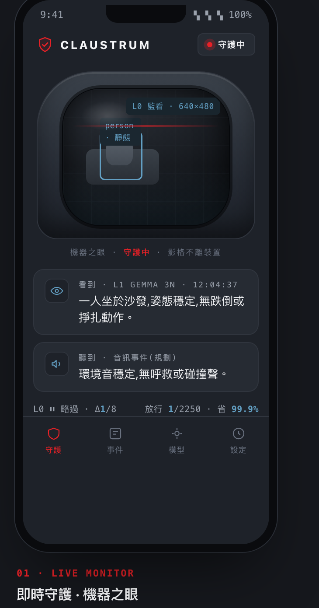
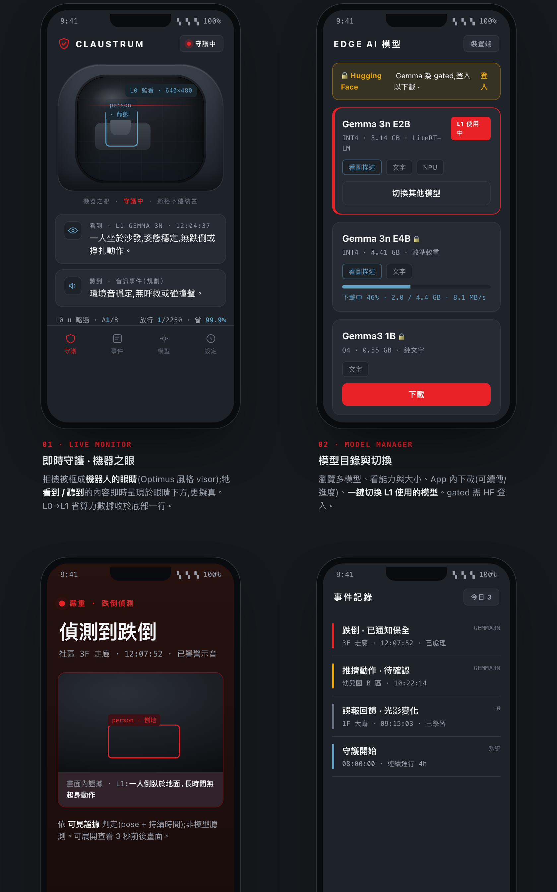
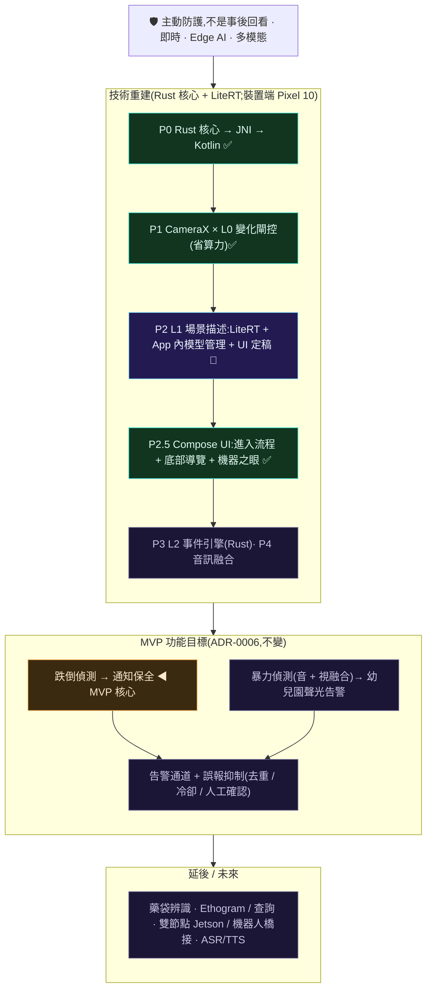
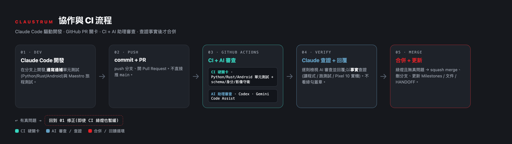

# claustrum

**把攝影機從「事後回看」變成「主動防護」的即時守護者。** 在裝置端(edge AI)即時融合視覺與音訊,主動偵測跌倒、暴力等安全事件,並在當下告警——而不是事發後才調閱錄影。全程在邊緣硬體上執行,影像不外傳。

Pixel 10 · **Rust 感知核心** · Google AI Edge / LiteRT · Kotlin / Jetpack Compose · Edge AI

> **核心命題:** 相機是主動防護的守護者,不是事後回看的記錄器——這正是為什麼整個系統必須**即時 · 串流 · 裝置端**(詳見 [ADR-0006](docs/adr/0006-safety-alert-mvp.md))。目前**手機優先、單節點**([ADR-0004](docs/adr/0004-phone-first-single-node.md))。
>
> 🦀 **架構重設計中(打掉重練,效能優先):Rust 感知核心 + 原生 Android**,移除 React Native([ADR-0007](docs/adr/0007-rust-first-redesign.md))。先前的 RN 版本(即時字幕已在其上驗證可行)留在 git 歷史作為參考。
>
> ⚠️ 這不是醫療器材,也不能取代真人監看與保全;偵測會漏報也會誤報。詳見下方「[安全與限制](#安全與限制)」。

## 設計概念 · UI / UX

> **設計語彙取 Tesla / Optimus 的精密科技感;相機被框成「機器之眼」——牠看到、聽到的內容即時呈現於眼下,更擬真。** 近單色石墨/白、髮絲級線條、單一 Tesla 紅強調、等寬儀表數據。

<p align="center">
  
</p>
<p align="center"><em>① 即時守護 · 機器之眼 —— 相機是牠的眼睛;牠看到(L1 客觀描述)、聽到(音訊)的內容即時呈現於眼下。</em></p>

**四個核心畫面**(互動原型可直接開瀏覽器:[`docs/design/ui/claustrum-uiux.html`](docs/design/ui/claustrum-uiux.html) · 說明:[`docs/design/ui/`](docs/design/ui/README.md)):



**① 即時守護 · 機器之眼** · **② 模型目錄與切換**(多模型 + App 內下載 + 一鍵切換 L1 模型)· **③ 主動告警**(附畫面內可見證據 → 通知保全)· **④ 事件記錄**(嚴重度分色 + 誤報回流)。

貫穿不變式:影格不離裝置;L1 只客觀描述、風險判斷屬 L2 且需可見證據;**模型可換為一等公民**。進入完整開發前,UI/UX 以此稿定義(dev-standards)。

## 它能做什麼

第一版 MVP:裝置端、多模態(視覺 + 音訊)的**主動安全事件偵測與告警**。

| 場景 | claustrum 做什麼 |
|---|---|
| 社區有人跌倒 | 裝置端即時偵測 → 數秒內**通知保全**,並附上原因 |
| 幼兒園發生暴力衝突 | 融合**聲音 + 畫面**偵測 → 主動**聲光告警** |

重點是**主動**:偵測與告警在事件當下於裝置上完成,影像不外傳。居家查詢、藥袋辨識等能力保留於路線圖後段。

## 技術棧

效能優先、**Rust 為感知核心**的原生架構(ADR-0007;取代 ADR-0005 的 React Native)。

| 層 | 技術 | 說明 |
|---|---|---|
| 感知核心(L0 閘控 · 影格管線 · L2/L3 事件引擎) | **Rust**(cargo-ndk → `.so`,JNI) | 記憶體安全 + 接近 C 的效能;逐幀比較與狀態機的家 |
| L1 VLM 推論 | **Google AI Edge / LiteRT**(Kotlin;LLM Inference,`.litertlm`) | on-device 多模態 Gemma,走 Tensor G5 NPU;沿用 AI Edge Gallery(Apache-2.0),不自建 llama.cpp(ADR-0009) |
| 相機擷取 | **CameraX(Kotlin)** | 影格交給 Rust,**永不進 UI 層** |
| 平台 / UI | **Kotlin + Jetpack Compose**(原生 Android) | 預覽 / 字幕 / 告警 / 控制;**無 React Native** |
| 領域契約 | **JSON Schema** | 跨 Rust / Kotlin / Python 單一真實來源 |
| 離線工具 | **Python**(bench / eval) | 基準測試、評測 |
| 建置 | Gradle + cargo-ndk(NDK 27) | Rust `.so` 隨 App 打包 |

資料流:`CameraX → Rust L0 閘控(每幀)→ 變化才喚醒 L1 VLM(Google AI Edge / LiteRT,只在放行幀)→ 描述 → Rust L2 事件 → UI`。**影格只在裝置端流動,只有文字描述進入後續判斷**(隱私 + 效能)。設計詳見 [ADR-0007](docs/adr/0007-rust-first-redesign.md)、[ADR-0009](docs/adr/0009-edge-ai-litert-ai-edge.md)。

## 路線圖與現階段重點

> **兩條軸線:** **技術重建**(ADR-0007 Rust 優先 / ADR-0009 LiteRT)在推進**怎麼實作**;**MVP 功能目標**(ADR-0006)是**要做到什麼**,不隨技術重建改變。早期 React Native + llama.rn 版本只是概念驗證,已淘汰(ADR-0007/0009),留在 git 歷史。技術進度對齊 [GitHub Milestones](https://github.com/TingFengChou/claustrum/milestones)。



完整里程碑、驗收標準與全景圖:[`docs/ROADMAP.md`](docs/ROADMAP.md);續作交接:[`docs/HANDOFF.md`](docs/HANDOFF.md)。

## 架構

連續影音無法逐格餵給模型。核心設計是一座**時間壓縮金字塔**;安全告警 MVP 的重心在 **L0→L2**:

```
 相機 30 fps + 麥克風音訊
     │
 L0  閘控        motion diff · pose landmarks · 音訊事件 · frame embedding
     │           → 決定哪些瞬間值得一次昂貴推論(目標 100×+ 壓縮)
     ▼
 L1  感知        裝置端 VLM(Google AI Edge / LiteRT;多模態 Gemma)→ 結構化 Kineme
     │
     ▼
 L2  告警        快路徑:pose / 音訊啟發式(recall)★ MVP 核心
     │           慢路徑:VLM 確認(precision)→ 通知保全 / 聲光告警
     ▼
 L3/L4 (延後)    摘要 Ethogram · 自然語言查詢
```

完整細節,包含 L2 為何拆成兩條路徑,詳見 [`docs/ARCHITECTURE.md`](docs/ARCHITECTURE.md)。

## 模組

**產品是原生 Android app + Rust 感知核心**(ADR-0007);Python 是離線工具。

| 模組 | 語言 | 狀態 | 用途 |
|---|---|---|---|
| `core-rs/` | Rust | 🟢 P0/P1 · P2 seam | 感知核心:L0 閘控(host 測綠)· L1 `Captioner` 邊界(佔位)· L2/L3 事件引擎(→ `.so`) |
| `android/` | Kotlin + Compose | 🟢 P1 · P2.5 UI | 原生 App:進入流程(Splash→介紹→守護)+ 底部導覽(守護/事件/模型/設定)+ 機器之眼;CameraX luma → Rust L0 閘控 → 放行幀喚醒 L1(Pixel 10 實測省 ~100% 運算)· LiteRT 引擎背景初始化 · **L1 真實場景描述已通(`.litertlm`-native Gemma 3n,~6.5s)** |
| `schemas/` | JSON Schema | ✅ 就緒 | 領域型別**單一真實來源**(跨 Rust / Kotlin / Python) |
| `core/` `bench/` `eval/` | Python | ✅ 就緒 | 領域型別參考、離線基準測試 / 評測(工具) |
| `app/`(舊) | React Native | 🗄️ 已淘汰 | 概念驗證(即時字幕 on-device 已驗證);保留於 git 歷史,ADR-0007 取代 |

L1 推論採 **Google AI Edge / LiteRT**(多模態 Gemma,`.litertlm`),走 Tensor G5 NPU;不自建 llama.cpp(ADR-0009)。用法見下方「Edge AI 模型使用」。影格只在裝置端流動。

### 設計文件(SA/SD)

每個模組完成即保有一份完整的 **SA**(做什麼/為什麼)與 **SD**(如何做,含測試策略)——常設規則,過時即視為 bug。索引與慣例見 [`docs/design/README.md`](docs/design/README.md)。

| 模組 | 狀態 | 設計文件 |
|---|---|---|
| `core-rs/`(Rust 感知核心) | 🟢 P0 | [SA](docs/design/core-rs/SA.md) · [SD](docs/design/core-rs/SD.md) |
| `android/`(Kotlin 裝置外殼) | 🟢 P0/P1 | [SA](docs/design/android/SA.md) · [SD](docs/design/android/SD.md) |
| `vlm/`(L1 場景描述) | 🔶 P2 seam | [SA](docs/design/vlm/SA.md) · [SD](docs/design/vlm/SD.md) |
| `model/`(App 內模型下載/切換) | 🔶 P2 | [SA](docs/design/model/SA.md) · [SD](docs/design/model/SD.md) |
| `events/`(時序事件引擎) | 📐 P3 規劃 | 與實作 PR 一併補上 SA/SD |
| `ui/`(UI/UX 設計定義) | 🎨 草案 v1 | [設計 + 互動原型](docs/design/ui/README.md) |
| `schemas/` 領域型別 | ✅ | 型別即 SoT;參考 [`core/`](docs/design/core/SD.md) |
| `app/`(舊 RN)· `medication/` | 🗄️ 參考 | [app SD](docs/design/app/SD.md) · [medication SD](docs/design/medication/SD.md)(ADR-0007 前) |

## 快速上手

P0/P1 + P2 seam 已可在裝置上跑(Pixel 10)。建置:Rust 感知核心 → `.so`(cargo-ndk),再由 Android(Gradle)打包。

```bash
git clone https://github.com/TingFengChou/claustrum.git
cd claustrum

# 1) Rust 核心:host 測 + 交叉編譯 .so 到 android jniLibs
cd core-rs && cargo test
export ANDROID_NDK_HOME=$ANDROID_HOME/ndk/27.1.12297006
cargo ndk -t arm64-v8a -o ../android/app/src/main/jniLibs build --release

# 2) Android App:單元測試 + 建 APK + 安裝
cd ../android && ./gradlew :app:testDebugUnitTest
./gradlew :app:assembleDebug
adb install -r app/build/outputs/apk/debug/app-debug.apk   # 舊簽章衝突先 adb uninstall com.claustrum
```

App 啟動 → 進入**模型目錄**下載一顆多模態 Gemma(見「Edge AI 模型使用」)→「進入即時偵測」看 L0→L1 管線。續作與交接見 [`docs/HANDOFF.md`](docs/HANDOFF.md)。離線工具(bench/eval,Python)見 [`bench/README.md`](bench/README.md)。

## Edge AI 模型使用(Google AI Edge / LiteRT)

> L1(場景描述/VLM)的**推論引擎採 Google AI Edge / LiteRT,不自建 llama.cpp**([ADR-0009](docs/adr/0009-edge-ai-litert-ai-edge.md),取代 ADR-0008)。理由:Gemma 3n 多模態只在 LiteRT 跑得動、走 Tensor G5 的 GPU/NPU 比 CPU 版 llama.cpp 快、跨平台(Android/iOS/macOS)、且 [Google AI Edge Gallery](https://github.com/google-ai-edge/gallery) 為 Apache-2.0 開源可直接沿用——**善用而非重造**。

### 這在感知管線的哪一層

```
CameraX(Kotlin)每幀 luma
  → L0 變化閘控(Rust core-rs,每幀)           只有「場景有變」才放行
  → [僅放行幀] L1 場景描述(LiteRT / Kotlin)    多模態 Gemma:圖+文 → 一句描述
  → L2 事件(Rust,規劃)                        跌倒/離開/暴力 → 告警
```

每幀的熱路徑(L0)在 Rust;重模型(L1)只在**變化時**被喚醒,交給裝置 NPU 上的 LiteRT——這就是「省算力 + 用對工具」。

### 引擎與模型

| 項目 | 選用 |
|---|---|
| 執行期 | **LiteRT-LM SDK**(`com.google.ai.edge.litertlm:litertlm-android`;AI Edge Gallery 現行採用)。舊路徑 MediaPipe LLM Inference(`tasks-genai`)已進維護模式 |
| 模型 | LiteRT 社群的**多模態 Gemma**——Gemma 3n E2B/E4B(或 AI Edge 目前主打的 Gemma 4 E2B/E4B) |
| 格式 | **`.litertlm`** / `.task`(Task Bundle) |
| 能力 | 圖+文 → 文("Ask Image");日後音+文 |
| 加速 | Tensor G5 GPU / NPU(LiteRT delegate) |

### 取得模型:App 內建下載(產品化做法)

模型由 **App 自己下載與管理**(不靠 `adb push`、不靠另一個 App)——這是產品化的必要條件。做法參考 [Google AI Edge Gallery](https://github.com/google-ai-edge/gallery)(Apache-2.0):

- **模型目錄**:App 內列出多顆模型(Gemma 3n E2B/E4B…),顯示各自**能力**(看圖描述/文字)、大小、是否 gated。因為不同模型效果不同,**切換模型是一等公民**。
- **App 內下載**:WorkManager 前景服務,從 Hugging Face `resolve` URL 下載,**可續傳**、顯示進度、存到 App 專屬目錄。實作見 [`model` 模組](docs/design/model/SD.md)。
- **gated 授權**:Gemma 全系列在 HF 為 gated(Gemma 授權)→ App 內下載需 **HF 登入/存取權杖**;無授權時 App 誠實提示「需要授權(401)」。HF 登入流程為產品化下一步。

> 開發期若要略過 UI 直接放模型,可 `adb push` 到 `…/com.claustrum/files/models/v1/`(僅開發用,非產品路徑)。

### App 端如何載入與推論(規劃中的接法)

Android 端以 **LiteRT-LM**(`litertlm-android`)載入模型(啟用視覺 backend),對**放行幀**送「圖 + 文」得描述。API 形貌參考 AI Edge Gallery `LlmChatModelHelper`:

```kotlin
// 1) engine 載入一次,跨放行幀重用(初始化成本高;於 onDestroy 才 engine.close())
val engine = Engine(EngineConfig(
    modelPath = spec.localFile(context).absolutePath,
    backend = Backend.GPU(),
    visionBackend = Backend.GPU(),     // Gemma 3n 視覺需 GPU backend
    maxNumTokens = 512,
))
engine.initialize()

// 2) 每個「放行幀」用**全新對話**(單幀獨立判斷,不累積歷史→避免上下文污染與 token 爆量);用畢關閉
val conv = engine.createConversation(
    ConversationConfig(SamplerConfig(topK = 64, topP = 0.95, temperature = 1.0)))
conv.sendMessageAsync(
    Contents.of(listOf(
        Content.ImageBytes(admittedFrameBitmap.toPngByteArray()),  // 僅放行幀才編碼,非逐幀熱路徑
        Content.Text("請客觀描述畫面中可見的人物、姿態與動作,只描述看得到的事實,不要臆測或推論意圖。"),
    )),
    object : MessageCallback {
        override fun onMessage(m: Message) { /* 串流:更新 lastCaption */ }
        override fun onDone() { conv.close(); /* 客觀描述 → 交給 L2 依可見證據判斷 */ }
        override fun onError(t: Throwable) { conv.close(); /* 可辨識錯誤,不崩潰 */ }
    })
```

> **每幀新對話 + 影像編碼成本:** L1 只在 **L0 放行(場景有變)** 時被喚醒——靜態場景省下 ~99%,所以「新對話 + `toPngByteArray()`」不是逐幀熱路徑,只在變化時才付出。每幀獨立判斷也避免對話歷史累積造成的上下文污染 / token 爆量。
>
> 上為示意;`LiteRtCaptioner` 實作須守穩健性守則(生命週期先 `cancelProcess()` 再 `engine.close()`、推論中丟棄新放行幀防重入、編碼/推論在背景執行緒)——見 [vlm SD §6.1](docs/design/vlm/SD.md)。

實作落在 Kotlin 的 `LiteRtCaptioner`,實作一個**純 Kotlin `Captioner` 介面**(對應 [`vlm`](docs/design/vlm/SD.md) 邊界)——如此 L0→L1 觸發邏輯可用假的 `Captioner` 在 Host 端單元測試,不綁硬體。詳細 API 與版本以官方文件 / AI Edge Gallery 為準。

> **不變式:L1 只做客觀描述,不判風險、不臆測。** 風險/事件判斷是 **L2** 的職責,且 `risk.level != none` 必須有**畫面內可見證據**——所以提示詞嚴格限制在「描述看得到的」,避免 VLM 幻覺出不存在的威脅(誤報是本專案的頭號敵人)。

### 現況

L1 目前為 `core-rs` 的**佔位後端**(誠實診斷:尺寸/亮度/2×2 網格,標示「未載入 VLM」,不偽造理解),證明 L0→L1 觸發管線在 Pixel 10 端到端可跑。**`LiteRtCaptioner`(真多模態)接入中**——見 [ROADMAP](docs/ROADMAP.md) P2、[ADR-0009](docs/adr/0009-edge-ai-litert-ai-edge.md)。

### 隱私

影格只在裝置端流動、用完即刪(手機優先單節點,[ADR-0004](docs/adr/0004-phone-first-single-node.md));只有 L1 產出的**文字描述**進入後續 L2 判斷——不外傳、不落地、不留人物身分特徵。

## 測試

邊開發邊補測試(dev-standards);由 GitHub Actions 自動跑:

| 類型 | 工具 | 範圍 |
|---|---|---|
| 單元(純邏輯) | Python `unittest` · Rust `cargo test` · Android JVM `:app:testDebugUnitTest` | schema/領域型別、L0 `gate`/`ChangeGate`、`ModelSpec` 目錄邏輯… |
| UI / 使用者旅程 | **[Maestro](https://maestro.mobile.dev)**(`.maestro/*.yaml`) | 模型下載/切換、進入即時偵測、告警處置(`maestro test .maestro/`) |
| 裝置整合 | 裝置實測 / `androidTest` | JNI、CameraX、LiteRT 推論 |

CI(`.github/workflows/ci.yml`)硬性關卡跑上述單元測試 + schema/identity 守衛;Maestro journey 於裝置/模擬器執行。Maestro flow 不驗證任何真實機密(如 HF 權杖)。

## 協作與 CI 流程

我們用 **Claude Code 驅動開發 + GitHub PR 關卡**協作。每個功能/phase 都走同一條路,方便分享與交接:



**規則(硬性,見 [`docs/DEVELOPMENT.md`](docs/DEVELOPMENT.md)):**

- **不直接推 `main`**;一律分支 → PR。CI(`.github/workflows/ci.yml`)是**硬關卡**(測試 + schema/身分/影像守衛),紅燈不得合併。
- **AI 助理審查**於 GitHub Actions 上跑:**Codex**(`AGENTS.md` 規則)與 **Gemini Code Assist**(`.gemini/`)為固定 reviewer;另有本機 `agy`。安裝方式見下。
- **合併前先諮詢 AI 審查**:逐則檢視並**回覆**,經**查證事實**(讀程式、跑測試、Pixel 10 實機)確認不是真問題後才 merge —— 不看綠勾蓋章。
- 完成里程碑同步更新 README/ROADMAP/SA-SD 與 **GitHub Milestones**;交接記於 [`docs/HANDOFF.md`](docs/HANDOFF.md)。

**把 AI reviewer 變成固定 reviewer(owner 一次性設定):**

- **Gemini Code Assist** —— 安裝 [GitHub App](https://github.com/apps/gemini-code-assist) 並選本 repo;依 [`.gemini/config.yaml`](.gemini/config.yaml) + [`.gemini/styleguide.md`](.gemini/styleguide.md) 自動審查每個 PR。
- **OpenAI Codex** —— 於 [Codex GitHub 整合](https://developers.openai.com/codex/integrations/github) 連結 repo 並開 **Automatic reviews**;依 [`AGENTS.md`](AGENTS.md) 的 Code Review Rules 審查(或留言 `@codex review`)。
- 我們自建的 `ai-review.yml`(需 `GEMINI_API_KEY` secret)為備援;裝上官方 App 後可退役。

## Firebase(規劃)

雲端後端採 Firebase,但**感知全在裝置端、影格永不上雲**([ADR-0010](docs/adr/0010-firebase-architecture.md)):

- **Remote Config** —— 只放**非機密**設定(模型目錄、L0 閾值、告警冷卻、feature flags)。**權杖/機密絕不放 Remote Config**(用戶端可讀 → 會洩漏)。
- **FCM** 告警推播給保全/家屬 · **Firestore** 只同步**文字事件**(無影格/PII)· **App Check** 防濫用 · **Auth / Cloud Functions + Secret Manager** 承載 gated 模型授權(HF OAuth 或伺服器代理,權杖不下 client)。

> gated 模型授權的產品化正解是 **HF OAuth 登入**(像 AI Edge Gallery)或**伺服器下載代理**;目前 App 內為 interim 的加密「貼權杖」。

## 部署拓撲

**現在 —— 手機優先、單節點**(ADR-0004):Pixel 10 一手包辦相機 + 麥克風擷取、L0–L2 偵測、告警。單一行程同時持有影格並判斷,因此影格隔離是靠**政策**(不外傳、用完即刪)而非拓撲來落實——這是手機優先所承擔、且刻意為之的暫時代價。**日後**一旦 Jetson 就緒,再恢復 [ADR-0003](docs/adr/0003-two-node-topology.md) 的雙節點結構性影格隔離。

## 名字的由來

**claustrum**(屏狀核)是一薄層神經元,幾乎與每一個大腦皮質區都有連結。Crick 與 Koch 曾提出,它正是把各自獨立的感官模態綁定為單一統一體驗的結構 —— 他們將它比喻為管弦樂團的指揮。這正是本專案要做的事:把視覺與音訊(日後含語言)綁定為一份連貫、即時的理解,用於當下的防護判斷。

## 領域詞彙

這套程式碼刻意採用一組貫徹一致的詞彙,取自動物行為學 (ethology)、身勢學 (kinesics) 與行動者網絡理論 (actor-network theory)。這三個傳統共享同一項方法論承諾:**記錄觀察到的事,不臆測動機。**

| 詞彙 | 在此的意義 | 出處 |
|---|---|---|
| **Actant** | 場景中的一個參與者 —— `person_1`、`cat`。是**角色槽位,而非身分。** | 行動者網絡理論 (Latour) |
| **Kineme** | 觀察到的行為之最小記錄單位。一個動作、一段時間。 | 身勢學 (Birdwhistell) |
| **Ethogram** | 一段期間內眾多 kineme 的目錄。 | 動物行為學 |

`Actant` 之所以是角色槽位而非某個人,就是隱私設計本身:本專案不做人臉辨識,也不做身分歸屬。詳見 [`docs/adr/0002-naming-and-domain-language.md`](docs/adr/0002-naming-and-domain-language.md)。

## 安全與限制

這套系統是協助人力的**一層額外警覺**,不是唯一的安全網。

- **不是醫療器材,也不能取代真人監看與保全。** 跌倒/暴力偵測會漏掉事件,也會產生誤報;對外告警(通報保全/園方)尤其需要誤報抑制與人工確認。
- **需知情同意。** 任何部署都需取得現場相關人員同意。**幼兒園等涉及兒童的場景**,兒童個資屬高度敏感(PDPA),需機構同意、家長告知與明確治理。
- **隱私。** 影像/聲音只在裝置端處理、不外傳、用完即刪。在把鏡頭對準任何人之前,請先讀 [`docs/PRIVACY.md`](docs/PRIVACY.md)。

## 關鍵指標

MVP 以這些指標評斷成敗,而非展示效果:

| 指標 | 目標 |
|---|---|
| 跌倒偵測召回率 | > 90 % |
| **每 24 小時誤報數** | **< 1** |
| 端到端告警延遲 (p95) | < 5 秒 |
| 無熱節流的連續運轉時間 | 7 天 |

每 24 小時誤報數是首要指標:一套每天狼來了一次的系統會很快被靜音,到那時召回率再高也毫無意義——對「通報保全」這種對外告警尤其如此。

## 開發

工作透過 **PR** 交付:分支 → commit → push → PR。push 後 GitHub Actions 跑 **CI(硬關卡)** 與 **AI 助理審查**(雲端 Gemini / 可擴充 Codex;需 `GEMINI_API_KEY` secret,未設時由本機 `agy` 涵蓋);**逐則檢視並回覆審查意見,經查證確認不是問題後才 merge**——依事實決定,不看綠勾蓋章。每個模組保有 [SA/SD 設計文件](docs/design/README.md);模組以可測試性為前提建置;App UI 以 Claude 設計到接近產品化;文件隨里程碑一併更新。完整流程:[`docs/DEVELOPMENT.md`](docs/DEVELOPMENT.md)、交接見 [`docs/HANDOFF.md`](docs/HANDOFF.md)。這些標準也編寫成 `dev-standards` skill。

## 決策

- [ADR-0001 — 平台:Jetson AGX Orin 而非 Android](docs/adr/0001-platform-choice.md)(已被 ADR-0004 取代)
- [ADR-0002 — 命名與領域語言](docs/adr/0002-naming-and-domain-language.md)
- [ADR-0003 — 雙節點拓撲與影格隔離邊界](docs/adr/0003-two-node-topology.md)(已被 ADR-0004 延後)
- [ADR-0004 — 手機優先、單節點啟動](docs/adr/0004-phone-first-single-node.md)
- [ADR-0005 — 產品主體為 React Native app](docs/adr/0005-react-native-app.md)(已被 ADR-0007 取代)
- [ADR-0006 — MVP 重新聚焦:多模態主動安全告警](docs/adr/0006-safety-alert-mvp.md)
- [ADR-0007 — 打掉重練:Rust 優先、效能優先的原生架構](docs/adr/0007-rust-first-redesign.md)
- [ADR-0008 — L1 場景描述引擎:可抽換 Captioner 邊界](docs/adr/0008-l1-caption-engine.md)(llama.cpp 後端已被 ADR-0009 取代;邊界/佔位仍有效)
- [ADR-0009 — L1 改用 Google AI Edge / LiteRT(不自建 llama.cpp)](docs/adr/0009-edge-ai-litert-ai-edge.md)
- [ADR-0010 — Firebase 架構(雲端後端;影格不上雲、機密不進 Remote Config)](docs/adr/0010-firebase-architecture.md)

## 授權

Apache-2.0。詳見 [`LICENSE`](LICENSE)。
