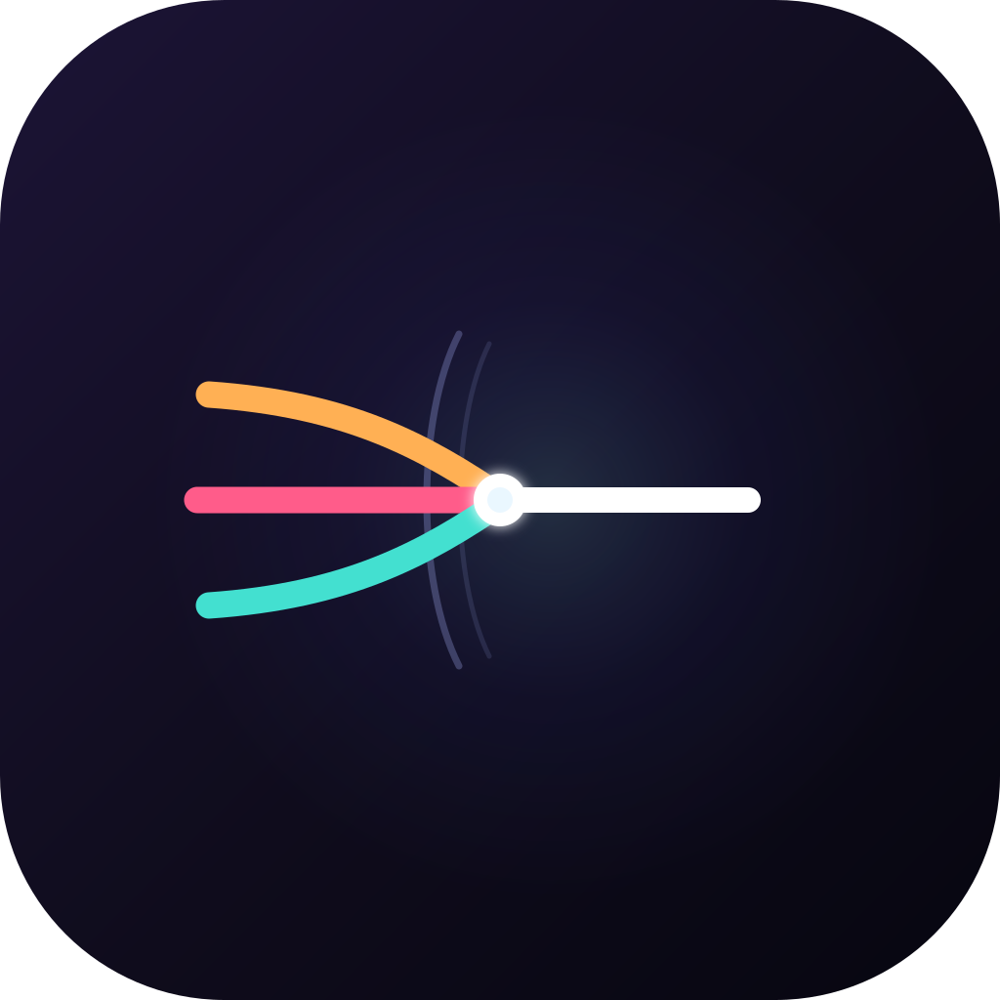
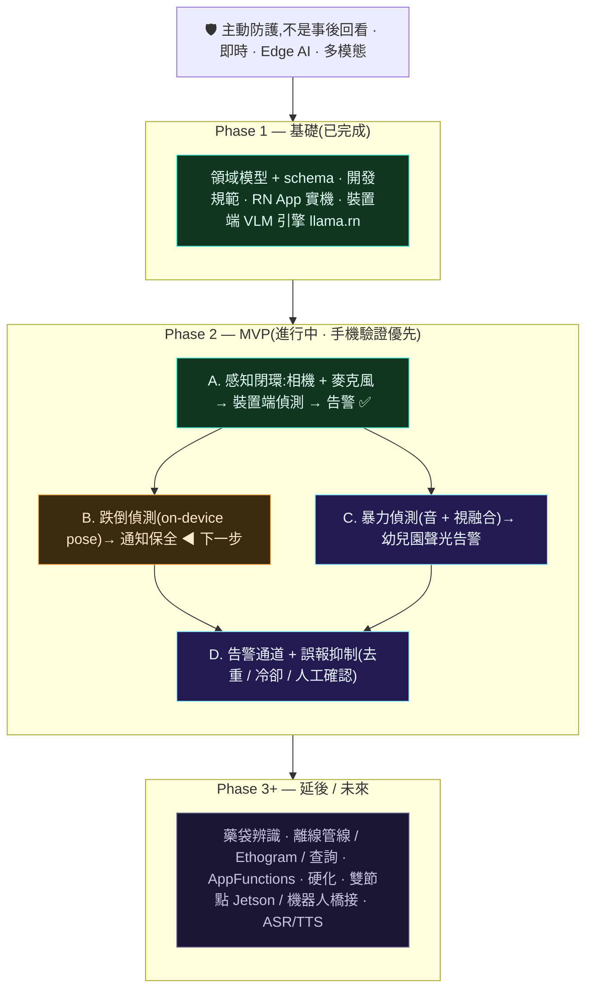

# claustrum

**把攝影機從「事後回看」變成「主動防護」的即時守護者。** 在裝置端(edge AI)即時融合視覺與音訊,主動偵測跌倒、暴力等安全事件,並在當下告警——而不是事發後才調閱錄影。全程在邊緣硬體上執行,影像不外傳。

Pixel 10 · **Rust 感知核心** · llama.cpp · Kotlin / Jetpack Compose · Edge AI

> **核心命題:** 相機是主動防護的守護者,不是事後回看的記錄器——這正是為什麼整個系統必須**即時 · 串流 · 裝置端**(詳見 [ADR-0006](docs/adr/0006-safety-alert-mvp.md))。目前**手機優先、單節點**([ADR-0004](docs/adr/0004-phone-first-single-node.md))。
>
> 🦀 **架構重設計中(打掉重練,效能優先):Rust 感知核心 + 原生 Android**,移除 React Native([ADR-0007](docs/adr/0007-rust-first-redesign.md))。先前的 RN 版本(即時字幕已在其上驗證可行)留在 git 歷史作為參考。
>
> ⚠️ 這不是醫療器材,也不能取代真人監看與保全;偵測會漏報也會誤報。詳見下方「[安全與限制](#安全與限制)」。

## 它能做什麼

第一版 MVP:裝置端、多模態(視覺 + 音訊)的**主動安全事件偵測與告警**。

| 場景 | claustrum 做什麼 |
|---|---|
| 社區有人跌倒 | 裝置端即時偵測 → 數秒內**通知保全**,並附上原因 |
| 幼兒園發生暴力衝突 | 融合**聲音 + 畫面**偵測 → 主動**聲光告警** |

重點是**主動**:偵測與告警在事件當下於裝置上完成,影像不外傳。居家查詢、藥袋辨識等能力保留於路線圖後段。

## 技術棧

效能優先、**Rust 為感知核心**的原生架構(ADR-0007;取代 ADR-0005 的 React Native)。

| 層 | 技術 | 說明 |
|---|---|---|
| 感知核心(L0 閘控 · 影格管線 · L2/L3 事件引擎) | **Rust**(cargo-ndk → `.so`,JNI) | 記憶體安全 + 接近 C 的效能;逐幀比較與狀態機的家 |
| L1 VLM 推論 | **llama.cpp(C/C++)** via Rust FFI(`llama-cpp-2`) | on-device 多模態(SmolVLM / Gemma),已裝置驗證 |
| 相機擷取 | **CameraX(Kotlin)** | 影格交給 Rust,**永不進 UI 層** |
| 平台 / UI | **Kotlin + Jetpack Compose**(原生 Android) | 預覽 / 字幕 / 告警 / 控制;**無 React Native** |
| 領域契約 | **JSON Schema** | 跨 Rust / Kotlin / Python 單一真實來源 |
| 離線工具 | **Python**(bench / eval) | 基準測試、評測 |
| 建置 | Gradle + cargo-ndk(NDK 27) | Rust `.so` 隨 App 打包 |

資料流:`CameraX →(JNI)Rust:L0 閘控 → 變化才叫 VLM(llama.cpp)→ Kineme → L2 事件 →(JNI)→ Compose UI`。**影格與像素只在原生層流動**(隱私 + 效能)。設計詳見 [ADR-0007](docs/adr/0007-rust-first-redesign.md)。

## 路線圖與現階段重點

> **現在:架構重建(ADR-0007,Rust 優先、效能優先)。** 感知閉環與即時字幕已在 RN 版於 Pixel 10 驗證可行(概念驗證);正以 **Rust 原生核心 + Android(Compose)** 重建。重建階段 P0–P4 見 [ADR-0007](docs/adr/0007-rust-first-redesign.md)。下方全景圖為 MVP 的功能目標(A–D),不隨此次技術重建改變。



完整里程碑、驗收標準與全景圖:[`docs/ROADMAP.md`](docs/ROADMAP.md)。

## 架構

連續影音無法逐格餵給模型。核心設計是一座**時間壓縮金字塔**;安全告警 MVP 的重心在 **L0→L2**:

```
 相機 30 fps + 麥克風音訊
     │
 L0  閘控        motion diff · pose landmarks · 音訊事件 · frame embedding
     │           → 決定哪些瞬間值得一次昂貴推論(目標 100×+ 壓縮)
     ▼
 L1  感知        裝置端 VLM(llama.cpp via Rust FFI;SmolVLM / Gemma)→ 結構化 Kineme
     │
     ▼
 L2  告警        快路徑:pose / 音訊啟發式(recall)★ MVP 核心
     │           慢路徑:VLM 確認(precision)→ 通知保全 / 聲光告警
     ▼
 L3/L4 (延後)    摘要 Ethogram · 自然語言查詢
```

完整細節,包含 L2 為何拆成兩條路徑,詳見 [`docs/ARCHITECTURE.md`](docs/ARCHITECTURE.md)。

## 模組

**產品是原生 Android app + Rust 感知核心**(ADR-0007);Python 是離線工具。

| 模組 | 語言 | 狀態 | 用途 |
|---|---|---|---|
| `core-rs/` | Rust | 🟢 P0 完成 | 感知核心:L0 閘控(host 測綠)· 影格管線 · L2/L3 事件引擎(→ `.so`) |
| `android/` | Kotlin(P0/P1)→ Compose | 🟢 P1 完成 | 原生 App:載入 `.so` · CameraX luma → Rust L0 變化閘控(Pixel 10 實測靜態場景省 ~100% 運算);L1 字幕/UI 續接 |
| `schemas/` | JSON Schema | ✅ 就緒 | 領域型別**單一真實來源**(跨 Rust / Kotlin / Python) |
| `core/` `bench/` `eval/` | Python | ✅ 就緒 | 領域型別參考、離線基準測試 / 評測(工具) |
| `app/`(舊) | React Native | 🗄️ 已淘汰 | 概念驗證(即時字幕 on-device 已驗證);保留於 git 歷史,ADR-0007 取代 |

L1 推論用 **llama.cpp**(via Rust FFI),已在 Pixel 10 驗證 on-device 多模態(SmolVLM / Gemma)。影格與像素只在原生層流動。

## 快速上手

架構重建中(ADR-0007)。目標建置流程:Rust 感知核心 → `.so`(cargo-ndk),再由 Android(Gradle)打包。

```bash
git clone https://github.com/TingFengChou/claustrum.git
cd claustrum
# core-rs/  → cargo ndk -t arm64-v8a build --release   (產生 .so)
# android/  → ./gradlew assembleRelease                (打包並安裝到 Pixel 10)
# P0 骨架建置中;詳見 docs/adr/0007-rust-first-redesign.md 與 docs/ROADMAP.md
```

離線工具(bench/eval,Python)見 [`bench/README.md`](bench/README.md)。

## 部署拓撲

**現在 —— 手機優先、單節點**(ADR-0004):Pixel 10 一手包辦相機 + 麥克風擷取、L0–L2 偵測、告警。單一行程同時持有影格並判斷,因此影格隔離是靠**政策**(不外傳、用完即刪)而非拓撲來落實——這是手機優先所承擔、且刻意為之的暫時代價。**日後**一旦 Jetson 就緒,再恢復 [ADR-0003](docs/adr/0003-two-node-topology.md) 的雙節點結構性影格隔離。

## 名字的由來

**claustrum**(屏狀核)是一薄層神經元,幾乎與每一個大腦皮質區都有連結。Crick 與 Koch 曾提出,它正是把各自獨立的感官模態綁定為單一統一體驗的結構 —— 他們將它比喻為管弦樂團的指揮。這正是本專案要做的事:把視覺與音訊(日後含語言)綁定為一份連貫、即時的理解,用於當下的防護判斷。

## 領域詞彙

這套程式碼刻意採用一組貫徹一致的詞彙,取自動物行為學 (ethology)、身勢學 (kinesics) 與行動者網絡理論 (actor-network theory)。這三個傳統共享同一項方法論承諾:**記錄觀察到的事,不臆測動機。**

| 詞彙 | 在此的意義 | 出處 |
|---|---|---|
| **Actant** | 場景中的一個參與者 —— `person_1`、`cat`。是**角色槽位,而非身分。** | 行動者網絡理論 (Latour) |
| **Kineme** | 觀察到的行為之最小記錄單位。一個動作、一段時間。 | 身勢學 (Birdwhistell) |
| **Ethogram** | 一段期間內眾多 kineme 的目錄。 | 動物行為學 |

`Actant` 之所以是角色槽位而非某個人,就是隱私設計本身:本專案不做人臉辨識,也不做身分歸屬。詳見 [`docs/adr/0002-naming-and-domain-language.md`](docs/adr/0002-naming-and-domain-language.md)。

## 安全與限制

這套系統是協助人力的**一層額外警覺**,不是唯一的安全網。

- **不是醫療器材,也不能取代真人監看與保全。** 跌倒/暴力偵測會漏掉事件,也會產生誤報;對外告警(通報保全/園方)尤其需要誤報抑制與人工確認。
- **需知情同意。** 任何部署都需取得現場相關人員同意。**幼兒園等涉及兒童的場景**,兒童個資屬高度敏感(PDPA),需機構同意、家長告知與明確治理。
- **隱私。** 影像/聲音只在裝置端處理、不外傳、用完即刪。在把鏡頭對準任何人之前,請先讀 [`docs/PRIVACY.md`](docs/PRIVACY.md)。

## 關鍵指標

MVP 以這些指標評斷成敗,而非展示效果:

| 指標 | 目標 |
|---|---|
| 跌倒偵測召回率 | > 90 % |
| **每 24 小時誤報數** | **< 1** |
| 端到端告警延遲 (p95) | < 5 秒 |
| 無熱節流的連續運轉時間 | 7 天 |

每 24 小時誤報數是首要指標:一套每天狼來了一次的系統會很快被靜音,到那時召回率再高也毫無意義——對「通報保全」這種對外告警尤其如此。

## 開發

工作透過 **PR** 交付,合併前以 **AI 程式碼審查**(本機 Antigravity CLI `agy`)與 CI 把關;merge 依查證事實決定。每個模組保有 SA/SD 設計文件;模組以可測試性為前提建置;App UI 以 Claude 設計;文件隨里程碑一併更新。完整流程:[`docs/DEVELOPMENT.md`](docs/DEVELOPMENT.md)。這些標準也編寫成 `dev-standards` skill。

## 決策

- [ADR-0001 — 平台:Jetson AGX Orin 而非 Android](docs/adr/0001-platform-choice.md)(已被 ADR-0004 取代)
- [ADR-0002 — 命名與領域語言](docs/adr/0002-naming-and-domain-language.md)
- [ADR-0003 — 雙節點拓撲與影格隔離邊界](docs/adr/0003-two-node-topology.md)(已被 ADR-0004 延後)
- [ADR-0004 — 手機優先、單節點啟動](docs/adr/0004-phone-first-single-node.md)
- [ADR-0005 — 產品主體為 React Native app](docs/adr/0005-react-native-app.md)(已被 ADR-0007 取代)
- [ADR-0006 — MVP 重新聚焦:多模態主動安全告警](docs/adr/0006-safety-alert-mvp.md)
- [ADR-0007 — 打掉重練:Rust 優先、效能優先的原生架構](docs/adr/0007-rust-first-redesign.md)

## 授權

Apache-2.0。詳見 [`LICENSE`](LICENSE)。
