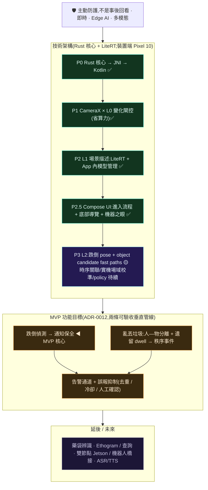
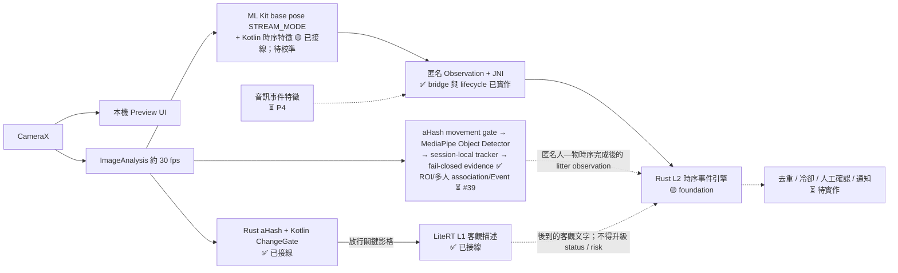
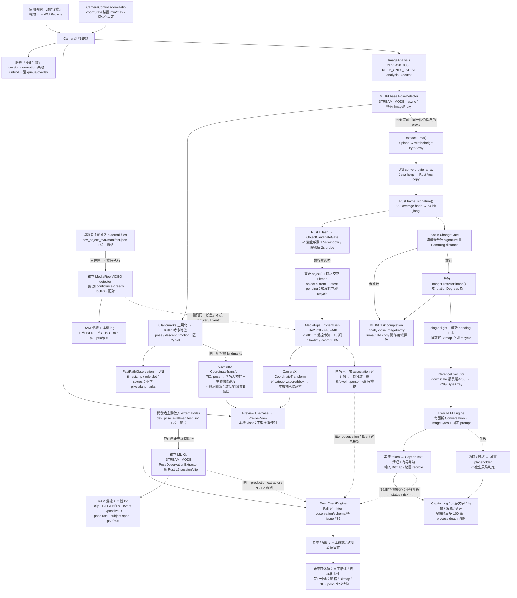
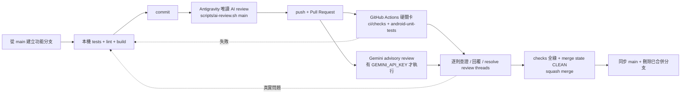

# claustrum

**把攝影機從「事後回看」變成「主動防護」的即時守護者。** 近期只聚焦裝置端(edge AI)
的跌倒／倒地安全與亂丟垃圾兩個可驗收情境，不做泛用影像理解。
目前已完成相機串流、L0 變化閘控與 L1 客觀場景描述；L2 已有 Rust engine 與
Android↔JNI bridge，並接上 ML Kit `STREAM_MODE` 單人 pose fast path 實際產生 observation。
MediaPipe Object Detector 候選快路徑與 session-local 匿名人／物短時 tracker 也已接線；它只
顯示類別、槽位、移動與可見時序階段，不會把單幀類別或內部 evidence 誤稱為亂丟垃圾。兩條
路徑仍待真實素材校準，litter Event、policy 與對外告警尚未啟用。影像不外傳。

Pixel 10 · **Rust 感知核心** · Google AI Edge / LiteRT · Kotlin / Jetpack Compose · Edge AI

> **核心命題:** 相機是主動防護的守護者,不是事後回看的記錄器——這正是為什麼整個系統必須**即時 · 串流 · 裝置端**(詳見 [ADR-0006](docs/adr/0006-safety-alert-mvp.md))。目前**手機優先、單節點**([ADR-0004](docs/adr/0004-phone-first-single-node.md))。
>
> 🦀 **架構重設已完成遷移:Rust 感知核心 + 原生 Android**，React Native source 已移除
> ([ADR-0007](docs/adr/0007-rust-first-redesign.md))。目前工作是兩條事件管線的場域校準與產品化，
> 不是再次更換平台；先前 RN 版本只留在 git 歷史。
>
> ⚠️ 這不是醫療器材,也不能取代真人監看與保全;偵測會漏報也會誤報。詳見下方「[安全與限制](#安全與限制)」。

## 設計概念 · UI / UX

> **設計語彙取 Tesla / Optimus 的精密科技感;相機被框成「機器之眼」——牠看到、聽到的內容即時呈現於眼下,更擬真。** 近單色石墨/白、髮絲級線條、單一 Tesla 紅強調、等寬儀表數據。

<p align="center">
  
</p>
<p align="center"><em>① 即時守護 · 機器之眼 —— 相機是牠的眼睛；目前呈現 L1 客觀描述，音訊感知列為 P4 待續。</em></p>

**四個核心畫面**(互動原型可直接開瀏覽器:[`docs/design/ui/claustrum-uiux.html`](docs/design/ui/claustrum-uiux.html) · 說明:[`docs/design/ui/`](docs/design/ui/README.md)):


**① 即時守護 · 機器之眼** · **② 模型目錄與下載**(多模型 + App 內下載；切換待續)·
**③ 主動告警**(L2/通知尚在開發)· **④ 描述記錄**(目前保存 L1 文字供驗證)。

貫穿不變式:影格不離裝置;L1 只客觀描述、風險判斷屬 L2 且需可見證據;**模型可換為一等公民**。進入完整開發前,UI/UX 以此稿定義(dev-standards)。

## 目標與目前能力

第一版 MVP 已收斂為裝置端的**跌倒／倒地安全**與**亂丟垃圾**兩個事件([ADR-0012](docs/adr/0012-two-scenario-mvp-and-object-gating.md))。目前仍在
建構感知與事件判定管線，不能把下列目標場景解讀為已可部署的產品能力。

| 場景 | MVP 目標 | 目前狀態 |
|---|---|---|
| 社區有人跌倒 | 裝置端以可見時序證據確認，數秒內通知保全並附原因 | ML Kit 單人 pose→Kotlin 時序特徵→Rust state machine 已接線；實機校準 / policy / 通知待續 |
| 場域有人亂丟垃圾 | 以「人—物分離→物件落地並持續遺留→人離開」的可見時序證據建立候選事件 | MediaPipe detector + 動態閘門 + session-local 匿名 tracker + fail-closed evidence stage 已接線；ROI、多人 association、litter Event 與場域資料驗收見 issue #39 |

重點是**主動且可驗收**：不做泛用影像理解。偵測與告警在事件當下於裝置上完成，影像不外傳；
暴力、居家查詢、藥袋辨識等 foundation 保留但不列入近期完成定義。

## 技術棧

效能優先、**Rust 為感知核心**的原生架構(ADR-0007;取代 ADR-0005 的 React Native)。

| 層 | 技術 | 說明 |
|---|---|---|
| 感知核心(L0 signature · L2 事件引擎) | **Rust**(cargo-ndk → `.so`,JNI) | 每幀計算 64-bit aHash；L2 保存匿名 observation 的時序狀態 |
| L2 pose fast path | **ML Kit Pose Detection + Kotlin** | bundled base model `STREAM_MODE`；單人 landmark→保守 pose/descent/motion，未校準前不告警 |
| L2 object candidate fast path | **MediaPipe Object Detector + Kotlin** | pinned EfficientDet-Lite2 int8（448×448，精度優先）；受控 `VIDEO` category/bbox → session-local 幾何槽位 → 可見近接／分離／靜置 evidence；不把類別或 evidence stage 直接當垃圾 Event |
| L1 VLM 推論 | **Google AI Edge / LiteRT**(Kotlin;LiteRT-LM,`.litertlm`) | on-device 多模態 Gemma；目前實測 GPU/GPU，依序 fallback CPU/GPU、CPU/CPU；不自建 llama.cpp(ADR-0009) |
| 相機擷取 | **CameraX(Kotlin)** | Preview 只供本機 UI 顯示；ImageAnalysis 的 luma 交給 Rust L0，放行影格才交給 L1 |
| 平台 / UI | **Kotlin + Jetpack Compose**(原生 Android) | 預覽 / 字幕 / 告警 / 控制;**無 React Native** |
| 領域契約 | **JSON Schema** | 跨 Rust / Kotlin / Python 單一真實來源 |
| 離線工具 | **Python**(bench / eval) | 基準測試、評測 |
| 建置 | Gradle + cargo-ndk(NDK 27) | Rust `.so` 隨 App 打包 |

目標資料流有三條並行路徑：跌倒走 `CameraX → pose/motion extractor → Rust L2`；亂丟垃圾走
`CameraX → movement/ROI gate → object detector → 匿名人／物時序`；`CameraX → Rust L0 閘控 →
LiteRT L1` 只產生候選事件所需的客觀文字脈絡。**影格只在裝置端流動；
L2 只接收匿名結構化 observation 與可選文字，不接收 pixels。**目前 L0/L1 已接線，L2 Rust
engine/schema、Android↔JNI bridge、ML Kit 單人 pose、MediaPipe object candidate 與 Kotlin
短時 tracker/evidence stage 已接線；實機校準、ROI、多人 association、litter observation/schema
與 policy 待續。**設計詳見
[ADR-0007](docs/adr/0007-rust-first-redesign.md)、[ADR-0009](docs/adr/0009-edge-ai-litert-ai-edge.md)與
[ADR-0011](docs/adr/0011-l2-fast-path-evidence.md)與 [ADR-0012](docs/adr/0012-two-scenario-mvp-and-object-gating.md)。

## 路線圖與現階段重點

> **兩條軸線:** **技術架構**由 ADR-0007/0009 固定為 Rust + 原生 Android + LiteRT；
> **MVP 功能**由 ADR-0012 收斂為跌倒／倒地與亂丟垃圾。ADR-0006 的主動安全不變式仍有效，
> 但其較廣情境排序已被 ADR-0012 取代。技術進度對齊 [GitHub Milestones](https://github.com/TingFengChou/claustrum/milestones)。



完整里程碑、驗收標準與全景圖:[`docs/ROADMAP.md`](docs/ROADMAP.md);續作交接:[`docs/HANDOFF.md`](docs/HANDOFF.md)。

## 架構

連續影音無法逐格餵給重模型。安全事件不能等待慢速 VLM，因此架構不是單一路徑的
`L0 → L1 → L2`，而是 fast path 與語意脈絡並行：



實線是已存在或已有 foundation 的路徑；虛線是尚待接線的路徑。Pose fast path 先處理每個
CameraX analysis frame，再讓同一個仍開啟的 proxy 進 L0/L1；L0 只替昂貴的 L1 節流，
不作為 L2 fast path 的前置 gate，避免慢速描述與場景取樣造成時間敏感事件漏報。L3/L4 的
Ethogram 摘要與自然語言查詢屬後續路線圖，不在目前執行路徑。

完整細節,包含 L2 為何拆成兩條路徑,詳見 [`docs/ARCHITECTURE.md`](docs/ARCHITECTURE.md)。

## 模組

**產品是原生 Android app + Rust 感知核心**(ADR-0007);Python 是離線工具。

| 模組 | 語言 | 狀態 | 用途 |
|---|---|---|---|
| `core-rs/` | Rust | 🟢 P0/P1 · 🟡 P3 | 感知核心：L0 aHash/JNI + L2 Fall/ZoneExit/Violence 狀態機/Event serde + 安全的 event-engine handle registry |
| `android/` | Kotlin + Compose | 🟢 P1/P2.5 · 🟡 P3 fast path | 原生 App:CameraX→ML Kit 單人 pose→Rust L2；另有 MediaPipe object candidate、匿名短時 tracker/evidence 與 Rust L0→LiteRT L1；場域校準/Event/policy 待續 |
| `schemas/` | JSON Schema | ✅ 就緒 | 領域型別**單一真實來源**(跨 Rust / Kotlin / Python) |
| `core/` `bench/` `eval/` | Python | ✅ 就緒 | 領域型別參考、離線基準測試 / 評測(工具) |
| ~~`app/`(RN)~~ | React Native | 🗑️ 已移除 | 概念驗證(即時字幕 on-device 已驗證)· 已隨 ADR-0007/0009 淘汰並自 repo 移除,保留於 git 歷史 |

L1 推論採 **Google AI Edge / LiteRT**(多模態 Gemma,`.litertlm`)，目前 Pixel 10 實測
GPU/GPU；NPU 仍是待評估項目。不自建 llama.cpp(ADR-0009)。影格只在裝置端流動。

### 設計文件(SA/SD)

每個模組完成即保有一份完整的 **SA**(做什麼/為什麼)與 **SD**(如何做,含測試策略)——常設規則,過時即視為 bug。索引與慣例見 [`docs/design/README.md`](docs/design/README.md)。

| 模組 | 狀態 | 設計文件 |
|---|---|---|
| `core-rs/`(Rust 感知核心) | 🟢 P0 | [SA](docs/design/core-rs/SA.md) · [SD](docs/design/core-rs/SD.md) |
| `android/`(Kotlin 裝置外殼) | 🟢 P0/P1 | [SA](docs/design/android/SA.md) · [SD](docs/design/android/SD.md) |
| `vlm/`(L1 場景描述) | 🟢 P2（實機推論已通，效能待優化） | [SA](docs/design/vlm/SA.md) · [SD](docs/design/vlm/SD.md) |
| `model/`(App 內模型下載) | 🟢 P2(切換待續) | [SA](docs/design/model/SA.md) · [SD](docs/design/model/SD.md) |
| `events/`(時序事件引擎) | 🟡 P3 foundation | [SA](docs/design/events/SA.md) · [SD](docs/design/events/SD.md) |
| `ui/`(UI/UX 設計定義) | 🟢 主流程已實作（迭代中） | [設計 + 互動原型](docs/design/ui/README.md) |
| `schemas/` 領域型別 | ✅ | 型別即 SoT;參考 [`core/`](docs/design/core/SD.md) |
| `medication/`(藥單辨識) | 🗄️ 參考 | [medication SD](docs/design/medication/SD.md)(ADR-0007 前;`app/` RN 設計文件已隨程式移除,見 git 歷史) |

## 快速上手

現行 Rust L0/L2、Android CameraX 與 LiteRT L1 均可在 Pixel 10 執行；事件校準／policy 仍未完成。
建置順序為 Rust 感知核心 → `.so`(cargo-ndk)，再由 Android(Gradle)打包。

```bash
git clone https://github.com/TingFengChou/claustrum.git
cd claustrum

# 1) Rust 核心:host 測 + 交叉編譯 .so 到 android jniLibs
cd core-rs && cargo test
export ANDROID_NDK_HOME=$ANDROID_HOME/ndk/27.1.12297006
cargo ndk -t arm64-v8a -o ../android/app/src/main/jniLibs build --release

# 2) Android App:單元測試 + 建 APK + 安裝
cd ../android && ./gradlew :app:testDebugUnitTest
./gradlew :app:assembleDebug
adb install -r app/build/outputs/apk/debug/app-debug.apk   # 舊簽章衝突先 adb uninstall com.claustrum
```

App 啟動 → 模型 tab 可設定 HF read 權杖下載多模態 Gemma；物件候選則需先閱讀並同意
MediaPipe API metrics 告知，再下載 7.5 MB EfficientDet-Lite2。守護 tab 點「啟動守護」看
L0→L1 與候選框。L2 的 pose/object extractors 尚未完成素材校準與 litter 時序，policy 也未接，
因此 UI 仍不宣稱事件告警。續作見
[`docs/HANDOFF.md`](docs/HANDOFF.md)。

## Edge AI 模型使用(Google AI Edge / LiteRT)

> L1(場景描述/VLM)的**推論引擎採 Google AI Edge / LiteRT,不自建 llama.cpp**([ADR-0009](docs/adr/0009-edge-ai-litert-ai-edge.md),取代 ADR-0008)。理由:Gemma 3n 多模態可用 LiteRT 裝置 delegate；目前 Pixel 10 已驗證 GPU/GPU，NPU 待 issue #27 評估；且 [Google AI Edge Gallery](https://github.com/google-ai-edge/gallery) 為 Apache-2.0 開源可直接沿用——**善用而非重造**。

### 影像處理與傳導路徑(現況 + 兩條事件垂直管線)



虛線是尚未接線的 litter observation/Event、policy/告警與 L1 後補脈絡；其餘是目前
`MonitorActivity` 的實際影像生命週期。
單一 analyzer 先讓 ML Kit 讀 media image；task 完成後同一個仍開啟的 proxy 才進 L0→L1，最後
一定 close。L2 每個成功分析幀都產生 observation，**不經 L0 admit gate**。完整影格不會送入
Rust；L0 只有 luma copy，L2 只有匿名數值 observation。重模型 L1 僅處理放行後的旋正 Bitmap，
單次實測約 6.5–11.5 秒。

| 階段 | 執行位置 / 執行緒 | 輸入 → 輸出 | 擁有權、保存與傳輸 |
|---|---|---|---|
| 啟動 | Android main executor | 使用者動作 → CameraX bind | 未授權或 bind 失敗會回到可重試狀態，不會顯示正在守護 |
| 明確停止／重啟 | 跨四個 tab 的 Compose control → Android main executor | session generation 先失效 → analyzer clear、CameraX unbind、pending queue/overlay/tracker/L2 session 清除 | 舊 ML Kit／MediaPipe callback 即使稍後完成也會因 generation 不符被丟棄；正在執行的本機推論只允許收尾與 recycle，不會恢復畫框／事件；可再次手動啟動新 session |
| 預覽 | CameraX `Preview` → `PreviewView` | camera surface → 本機 visor | CameraX 管理 surface；App 不把 Preview 幀寫檔或送網路 |
| 安裝方向／zoom | CameraX `CameraControl` / `ZoomState` | UI ±0.5× → 裝置支援範圍內 zoomRatio | `fullSensor` + `OrientationEventListener` 同步 Preview/Analysis `targetRotation`；zoomRatio 持久化並在回前景重套；zoom 會縮窄 FOV，不能當作多人覆蓋方案 |
| 人物疊圖 | Android main thread / Compose Canvas | 8 個內部 landmarks → CameraX analysis-to-preview transform → 匿名「人體姿態候選」框 + 約略像素高度 | 不把 pose output 宣稱為已確認的人，不顯示骨架/身分/風險；`ImageProxyTransformFactory` + `CoordinateTransform` 處理 rotation/FIT_CENTER letterbox；只在 RAM，遺失/退背景/L2 停用立即清除 |
| 分析取幀 | `analysisExecutor` | `ImageProxy(YUV_420_888)` | `KEEP_ONLY_LATEST` 避免無界佇列；ML Kit task completion `finally image.close()`，只關一次 |
| L2 pose | ML Kit bundled base model，`STREAM_MODE` | 最顯著一人的 frame → 33 landmarks；App 只取肩/髖/膝/踝 | landmark 正規化後只在 RAM 保留相鄰幀；不跨 JNI、不落地、不辨識身分 |
| L2 特徵 | 純 Kotlin `PoseObservationExtractor` | landmarks → pose/descent/motion + 短時匿名 slot | tracking miss/gap/大跳位會換 slot，防止把不同人時序拼接；impact/contact/strike 固定 0 |
| 物件排程 | analyzer 的 Rust aHash → `ObjectCandidateGate` | scene signature → 是否建立 Bitmap 候選 | 變化達 4 bits 後每 ≥250ms、持續 1.5s；靜態每 2s probe。這只省算力，不能證明框內物件在動；ROI 尚待 #39 |
| 物件候選 | `objectExecutor` → MediaPipe Object Detector `VIDEO` | 旋正 Bitmap → allowlisted category/score/bbox | 獨立 current + latest pending 有界佇列；刻意不用 async `LIVE_STREAM`，由 App 明確擁有／recycle 每張 Bitmap；模型忙碌時合併中間候選。單幀 COCO 類別不能證明「垃圾」或意圖 |
| 匿名物件短時追蹤 | `objectExecutor` → `AnonymousObjectTracker` | normalized bbox → 同類別幾何 association、session-local P/O 槽位、速度／靜止 | 不用臉、外觀 embedding 或跨 session ID；3 秒 gap／明確停止／退背景／撤回即重設。候選過載會合併影格，所以槽位不是逐幀或身分保證 |
| 亂丟垃圾 evidence | `LitterEvidenceTracker`(純 Kotlin) | 連續人—物近接 → 可見分離 → 分離後靜置 → 人離開待檢視 | 人漏偵不能當分離；離開需同一槽位至少兩次可見拉遠、物件連續可見且靜置 ≥30 秒。最終仍不產生 Event/告警；ROI、多人 association 與場域門檻見 #39 |
| 物件疊圖 | main thread / Compose Canvas | CameraX transform → 橘色 bbox + P/O 槽位、移動／靜止、客觀 evidence stage、延遲／合併數 | 只在本機 RAM；不顯示身分或「垃圾」結論；rotation/FIT_CENTER/zoom 使用 CameraX transform；明確停止、退背景、撤回同意或 destroy 清除 |
| 固定鏡位物件評估(dev only) | `objectExecutor` 上的獨立 MediaPipe instance | 使用者標註影格 + normalized bbox → TP/FP/FN、precision/recall、matched IoU、最小 GT 像素、p50/p95 | 守護中禁止執行；不接 tracker/Event、不另存或上傳影格，只在 RAM/UI 與本機 log 留 aggregate；仍受 MediaPipe consent gate 約束 |
| 跌倒錄影回歸(dev only) | `poseEvalExecutor` 上的獨立 ML Kit instance；每 clip 新 extractor/Rust engine | strict event-window manifest + 影片 → clip TP/FP/FN/TN、event precision、positive recall、pose acquisition、人物跨度、p50/p95 | Android 9+；守護中禁止執行；連續批次解碼後每約 100ms 取樣，Bitmap 隨批次 recycle；離開前景使 generation 失效且不發布 partial summary；影格不另存或上傳 |
| L0 特徵 | Kotlin → JNI → Rust → Kotlin | Y plane `ByteArray` → 64-bit aHash | JNI 會複製 luma 到 Rust；Rust 不保存，回傳 hash 後釋放 |
| L0 決策 | Kotlin `PerceptionPipeline` / `ChangeGate` | hash → admit/skip + telemetry | 只保存 64-bit「最後放行 hash」；節流比例依場景而變 |
| L1 取圖 | analyzer，僅 admit | `ImageProxy` → 旋正 `Bitmap` | 必須在 proxy close 前複製；之後 proxy 立即關閉 |
| L1 排程 | `inferenceExecutor` | Bitmap → 目前處理 1 張 + pending 1 張 | 新 pending 取代舊 pending 時立即 `recycle()`；刻意合併中間畫面 |
| L1 前處理 | `LiteRtCaptioner` | Bitmap → ≤768 px 縮圖 → PNG bytes | 全在裝置記憶體；推論後縮圖與原輸入 Bitmap 都 recycle，PNG 由 GC 回收 |
| L1 推論 | LiteRT-LM，實測 GPU/GPU | image bytes + 固定客觀 prompt → token stream | Engine 重用、每張開新 Conversation；完成/取消後 close Conversation |
| L1 輸出 | Kotlin | tokens → 清理後繁中單句 | `CaptionLog` 只在 RAM 保存最近 100 筆文字；目前沒有 caption 上傳程式路徑 |
| L2 fast path | Android→JNI→Rust ✅，待素材校準 | 匿名 `FastPathObservation` → 有狀態 Rust session → Event JSON | engine handle 不是裸指標、close 可重入；目前 Event 只寫安全 log，不進 UI/通知 |
| L2 / 告警 | Rust engine ✅；Android policy 待接 | 校準後的 Event JSON → 去重/人工確認/通知 | 未達實機門檻前不啟用；VLM 文字只能後補脈絡，影格不得進 Event 或外傳 |

**MediaPipe 隱私邊界:** 官方說明 input image/video 全在裝置端，但 MediaPipe Tasks 會把 App
識別／版本、API 使用量、丟幀、延遲與錯誤等 metrics 傳給 Google，並要求依適用法律取得知情
同意。因此 App 預設不初始化 object detector；模型頁必須明確同意後才下載／啟用，並可撤回，
撤回後停止 detector。影像、bbox 與 category 不進該 telemetry。長期的無遙測替代／可重現 no-op
patch 追蹤於 [issue #41](https://github.com/TingFengChou/claustrum/issues/41)，完整說明見
[`docs/PRIVACY.md`](docs/PRIVACY.md)。

### 固定鏡位 Object Detector 評估

開發者模式新增「固定鏡位物件評估」，用來回答 Lite2 在 2F→1F 的 person／portable-object
候選究竟有多少 recall、false positive 與定位誤差；它**不是 litter 準確率**，也不會把結果接成
Event。先停止守護並在模型頁完成 MediaPipe consent／Lite2 下載，再把資料放入
`<externalFiles>/dev_object_eval/`：

```json
{
  "version": 1,
  "cases": [{
    "image": "roi2_day_001.jpg",
    "label": "roi2-day-person-bottle",
    "objects": [
      {"category":"person", "left":0.12, "top":0.08, "right":0.31, "bottom":0.91},
      {"category":"bottle", "left":0.42, "top":0.70, "right":0.46, "bottom":0.82}
    ]
  }, {
    "image": "roi2_rain_empty.jpg",
    "label": "roi2-rain-hard-negative",
    "objects": []
  }]
}
```

座標是相對解碼影像的 `0..1` bbox；category 必須在目前 detector allowlist。parser 拒絕路徑穿越、
重複影格、allowlist 外類別及任何未知欄位（包含 identity）。預測依 confidence 由高到低，以同類別
最高 IoU 的未配對 GT 做一對一配對，門檻固定 `IoU ≥ 0.5`；重複框算 FP，錯類別同時計 FP/FN，
空 `objects` 用來量 hard-negative failure。UI／log 回報 overall 與 per-category precision/recall、
matched mean IoU、最小 GT 短邊／面積，以及 detector avg/p50/p95/max latency。`—` 代表分母為零，
不可當成 100%。每張影格必須標完所有 allowlisted 物件，否則未標物件的正確 detection 會被算成
FP；含 EXIF rotation 的 JPEG 也要先轉正，使標註座標與 Android 解碼結果一致。min-pixel 是解碼後
來源影像的短邊／面積，供 zoom/FOV 比較，不冒充 448×448 模型內部特徵尺寸。標註影格不進 git、
不被 App 寫回或上傳；評估結束即 recycle Bitmap。

2026-08-08 Pixel 10 已用既有兩張非固定鏡位 dev 影格做**功能 smoke（不能列入場域驗收）**：
2 張／3 個 person GT 得 TP 0、FP 4（person 2 + suitcase 2）、FN 3；兩次 p50/p95 為
180/241 ms（首次）與 138/185 ms（重裝後暖機），
最小 GT 短邊 54 px。這只證明 parser→真 Lite2→metrics→Compose 接線可執行，也再次顯示通用 COCO
模型不可宣稱精確；issue #39 仍須用實際 2F→1F、1×/2×/3×、日夜／雨天／多人／小物正負標註集。

### 跌倒錄影回歸（ML Kit → Kotlin → Rust L2）

「▶ 測試影片」仍只驗 L0→L1 caption，不代表事件 recall；「△ L2 跌倒影片評估」才會讓每段
影片使用獨立 ML Kit `STREAM_MODE` detector，依序進 production `PoseObservationExtractor`、
JNI 與 Rust `EventEngine`。先停止守護，把自包含素材放入
`<externalFiles>/dev_pose_eval/`：

```json
{
  "version": 1,
  "cases": [{
    "video": "fall_001.mp4",
    "label": "roi2-fall-001",
    "expected": "fall",
    "eventStartMs": 1800,
    "eventEndMs": 6200
  }, {
    "video": "walk_001.mp4",
    "label": "roi2-walk-hard-negative",
    "expected": "none",
    "eventStartMs": null,
    "eventEndMs": null
  }]
}
```

`eventStartMs..eventEndMs` 是正例「可接受 confirmed」的明示閉區間，不是工具事後加的寬鬆
tolerance。區間內最多配對一個 confirmed；區間外或重複 confirmed 另計 false-confirmed event。
正例無配對是 FN；負例有任一 confirmed 是 FP。UI 的 event precision 是 matched confirmed / 全部
confirmed，positive recall 是命中正例 / 全部正例；沒有分母時顯示 `—`，不可當 100%。parser
拒絕路徑、重複影片、未知欄位（包含 identity）、無效副檔名與不完整時窗。

為避免 `getFrameAtTime` 每 100ms 反覆 seek／重建 decoder，Android 9+ 以
`getFramesAtIndex` 連續批次解碼，批次受 48 MiB pixel budget 限制，再依 frame count／duration
映到約 100ms 的影片時間軸。這要求可讀 frame count，且 frame-index 時間是 CFR 素材的近似值；
VFR 或需要逐幀精確 PTS 的正式驗收須先正規化成固定 frame rate，並在報告保存轉檔設定。每 clip
都重設 detector/extractor/Rust session，並以固定 synthetic Unix epoch + clip time 餵 L2、輸出
再換回 clip-relative window，避免跨片狀態污染或破壞正式 timestamp 契約；離開畫面或 destroy
只讓當前 ML/native call 收尾，之後不發布部分結果。來源影片是開發者明確放入的本機 corpus；App 不寫回、不上傳，
解碼 Bitmap 用完即 recycle，只有 aggregate 與本機 log 留在 RAM／程序內。

此工具回答「現有固定鏡位素材能否走完整 L2 並在標註時窗命中」，**不等於場域可部署**。正式
門檻仍需實際 2F→1F、1×/2×/3×、日夜／遮擋／多人，另加正常坐下、刻意躺下、清潔／協助等
hard negatives 與 72 小時無事件 corpus；對外告警合計仍須 `<1/24h`。

2026-08-08 Pixel 10 首輪 wiring/domain-gap smoke 使用既有 360×640 新聞剪輯，切成 8 秒跌倒
full-frame、同片 1.4× FOV crop，以及後續 32.9 秒多人協助 hard negative。結果為 clip
TP 0 / FP 0 / FN 2 / TN 1、candidate 0、confirmed 0、pose 取得 26.6%；兩次最終 APK 的 ML Kit
p50/p95 為 24/38 與 24/39ms。可靠 pose 的最小來源人物跨度 overall 46px；full-frame 重跑為
46–60px，1.4× crop 為 66px，顯示 detector／解碼抽樣結果本身也須多次量測。
1.4× 雖在對照中增加最低跨度，仍未建立「站立→快速下降→持續倒臥」candidate，證明小幅 zoom 不等於
event recall；多人負例未誤報則只是一段 smoke，不能推論 `<1/24h`。離開畫面 500ms 的實測會
記錄 lifecycle expired、清除 running，且不發布 partial summary。#26/#38 保持 open。

兩種 dev video 都是本機來源且不會上傳影片。模型下載的 Hugging Face／Google Storage HTTP
流量是獨立控制平面，只傳模型檔與必要授權 header，與相機影格資料平面沒有連線；MediaPipe
metrics 是另一條需明確同意的非影像控制流，不能和「推論 on-device」混為一談。

ADR-0008 的舊 Rust L1 診斷 seam（`NativeCore.describe` 與 `core-rs/src/vlm.rs`）已完整移除。
**Rust 現在仍正式承載**每幀 L0 `frameSignature` 與有狀態 L2 `EventEngine`；L1 則只有 Kotlin
`Captioner` + LiteRT-LM，JNI 不再暴露任何已淘汰的 L1 ABI。

**L1 的保證是有界與不阻塞，不是事件不漏報：**

- L1 在獨立背景 executor、single-flight 執行；取幀、L0 與 Preview 不被慢速推論阻塞。
- 推論忙碌時只保留最新 pending 放行幀，會刻意合併中間畫面；這適合更新場景描述，不能作為事件召回保證。
- 時間敏感事件必須由獨立 fast path 的連續 pose/motion/action observation 判定，不能依賴 L1 是否剛好描述到該瞬間。

**ML Kit `STREAM_MODE` 會不會限制整個專案？** 它會限制「跌倒」第一版 extractor 的單人召回，
但不應綁住另一條「亂丟垃圾」管線。
[官方文件](https://developers.google.com/ml-kit/vision/pose-detection/android)說明此模式會沿用前幀追蹤、
降低 video/camera 延遲，適合即時單人 pose；同時它只追畫面中最顯著的一人、Pose Detection 仍是
beta，[pose 概觀](https://developers.google.com/ml-kit/vision/pose-detection)並指出臉部需可見、完整
身體取景最佳。背向/遮擋/倒地後臉被擋可能造成 tracking miss，會直接威脅 fall recall 指標；姿態
landmark 也不能證明 impact 或多人 strike。因此目前可用於單人 fall candidate；無 impact 時要
持續倒臥才 confirmed。多人與快速 impact confirmation 必須另接可替換 extractor，不會硬塞進
ML Kit 輸出。目前 UI 只畫客觀匿名人物框，不展示關節細節，也不可宣稱已支援多人；限制、
MediaPipe multi-pose / person-detector 方案與實機驗收條件
已記於 [issue #36](https://github.com/TingFengChou/claustrum/issues/36)。

**相機方向現況:** App 已改為 `fullSensor`，Compose 在 landscape 以雙欄重排；
`OrientationEventListener` 會同步 Preview/Analysis `targetRotation`。Pixel 10 已驗證 portrait sensor
rotation + `FIT_CENTER` 的完整視野與 overlay mapping；90°/180°/270° 仍須逐向實機確認後才關閉
[issue #37](https://github.com/TingFengChou/claustrum/issues/37)。

**2F 俯視 1F 的 zoom 與真實場域:** CameraX 的 zoom 是 camera crop/zoom ratio 控制，能增加人物或
小物件送入 detector 的像素，但會同步縮窄視野、放大抖動並增加盲區。App 會顯示裝置實際
min/max、持久化倍率，並用約略人物高度提示低於 ML Kit 建議約 256 px 的取景；這只是 commissioning
指標，不是準確率保證。陡峭俯角仍會造成頭、軀幹、手中物與落地物自遮擋，數位 zoom 無法恢復
被遮住的證據。場域需對每個 ROI 比較 1×/2×/3× 的人物／小物 recall、完整 FOV、日夜與多人
交錯；若單一倍率不能同時滿足覆蓋與像素尺寸，正解是分區或多鏡頭，而不是繼續放大。驗收清單見
[issue #38](https://github.com/TingFengChou/claustrum/issues/38)。

2026-08-08 Pixel 10 對準實際 2F→1F 鏡位的首輪結果已證明風險不是理論：1× 畫面無可見行人時，
ML Kit 曾把樹幹／告示牌輪廓輸出為約 197 px 的人體姿態候選；切到 2× 後畫面出現一名被樹與告示牌
部分遮擋的行人，反而沒有 pose output。故 preview 只稱「候選」，跌倒不能由單幀 pose presence
決定；樹幹、路燈、告示牌、陰影及高角度遮擋已列為 72 小時 hard negatives。這個鏡位在完成
固定 ROI 素材 confusion matrix 前**不可部署跌倒告警**。

**MediaPipe Object Detector 如何減少無效分析?** 現行先用同一個 Rust aHash 驅動獨立 movement
gate：場景改變時開 1.5 秒 active window（最快每 250 ms 一幀），看似靜態時仍每 2 秒 probe，
避免慢速／小幅移動永久消失；再以 `categoryAllowlist` 只保留 person 與可攜候選物件。它使用
同步 `VIDEO` API 配合 current + latest pending queue，而非把 `ImageProxy` 所有權交給 async
`LIVE_STREAM`；兩者都會在負載過高時捨棄中間幀，但現行作法能明確 recycle Bitmap。ROI gate
尚待依 2F 場域資料設定，不能假裝已完成。
[官方輸出](https://developers.google.com/edge/mediapipe/solutions/vision/object_detector)只有 category、
score、bbox；EfficientDet-Lite2 的 COCO 類別也沒有「亂丟」意圖。因此 bottle/cup 或移動
物都只能是候選，必須經人—物分離、落地、持續遺留與人離開的時序才成立。完整實作與 hard-negative
驗收見 [issue #39](https://github.com/TingFengChou/claustrum/issues/39)。

目前 detector 後已接純 Kotlin `AnonymousObjectTracker` 與 `LitterEvidenceTracker`：只以同類別
bbox 的 IoU／中心距離建立 3 秒內 session-local `P/O` 槽位，並從連續「與人近接」開始累積。
只有同一人物槽位仍可見且與物件拉遠才叫「可見分離」；兩次可見拉遠、物件分離後靜置至少
30 秒、人物之後持續未見，才顯示「人離開待檢視」。人單純漏偵、既有靜止物、物件被取回、
track gap 或 App 退背景都 fail closed／重設。這是可觀察的內部 evidence stage，**不是 litter
Event、更不是意圖判定或告警**。多人交錯時的 greedy geometry association 仍可能換槽；需用
固定鏡位標註資料評估 ID-switch，未達門檻前不接 Event。

2026-08-08 同一 Pixel 10／2×／2F→1F 實測：Lite0（320×320）約 121 ms，畫面有一名小型行人時
輸出兩個落在樹木／告示牌附近的 `person` 候選，真人漏報；改用 Lite2（448×448）後空景約
176–227 ms；20 幀 window 為 p50 191 ms／p95 237 ms、提交 20 幀合併 2 幀，連續約三分鐘未再
對樹木產生候選。後續三人同框 smoke 只輸出兩個 `person`，且小框有十幾至數十像素 localization
誤差，**不能宣稱 recall/定位已可用**。Debug 全框探針把 480×640 input 映到 912×608 view 的
`(228,0)–(684,608)`，正好符合 FIT_CENTER letterbox 並與實際影像邊界對齊，故不應用 UI 常數
位移掩蓋 detector domain gap。
因此正式 catalog 選 Lite2 作較保守基線，代價是會合併部分影格；此通用 COCO 模型仍未達部署
證據門檻，必須以同一鏡位的正負樣本算 confusion matrix，不足時依官方 custom-model 流程微調。

加入 tracker 後的同裝置 smoke 已確認真 detector 結果能畫出 `人 P5 76%` 這類 session-local
槽位標籤，Activity 前後景 CameraService stop/start 後也能恢復；但稍後畫面清楚出現一名成人推
嬰兒車時 detector 回傳 0。這不是 tracker 能補救的問題：沒有 detection 就沒有 association。
因此目前只證明 runtime 接線與 reset，**不證明 person recall、槽位穩定或 litter 時序可用**。

**MediaPipe 在哪?** 目前 `tasks-vision 0.10.35` 實際承載 EfficientDet-Lite2 object candidates；
L1 場景描述則不走 MediaPipe LLM Inference，而用較新的 LiteRT-LM SDK(`litertlm-android`)讀
`.litertlm` 原生檔。原因是 Gemma 的 MediaPipe `.task` 在 litertlm 0.11.0 只會吐 `<pad>`（格式
不相容，見 [vlm/SD §6.1](docs/design/vlm/SD.md)）。不要把「object detector 的 MediaPipe `.tflite`」
與「L1 Gemma 的 `.litertlm`」混成同一模型格式。

模型頁的 7,515,971-byte Lite2 已用 App 的 WorkManager 實際下載，裝置 SHA-256 為
`b3f50554cb0ea559e90328845f7d9ba4d13c8bff372914d24e06bc8bb72fa896`；不同 size/hash 不會 rename
成正式模型。撤回 metrics 同意會直接通知 detector owner、停止新輸入並清框，不依賴下一張相機
影格；已下載模型重新同意後只熱載入，不重走網路。

#### 與 Google AI Edge Gallery 的關鍵差異

| 面向 | **claustrum(本專案)** | Google AI Edge Gallery |
|---|---|---|
| 定位 | **即時串流守護者**——相機持續「看」、主動偵測告警 | 能力展示 App / 手動問答 demo |
| 觸發 | CameraX 連續串流 → **L0 自動放行** | 使用者每次**手動**選圖 / 打字 |
| 省算力層 | **Rust aHash + Kotlin ChangeGate**(節省比例依場景而變) | 無(每次查詢都全量推論) |
| L1 SDK | LiteRT-LM `litertlm-android` 0.11.0 | 早期 MediaPipe `tasks-genai` → 近期亦轉 LiteRT-LM |
| 模型格式 | **`.litertlm` 原生**(`.task` 在 litertlm 只吐 `<pad>`) | `.task`(MediaPipe Task Bundle) |
| 提示詞 | **固定客觀場景描述**(一句、防臆測、抗誤報) | 使用者自由輸入 |
| 輸出處理 | **client 端一句話上限 + 逾時降級後備** | 完整多輪對話串流 |
| 影像來源 | 相機即時幀(旋正 + downscale) | 相簿選圖 / 拍照 |
| 隱私 | **影格不離裝置**,只外傳文字描述 / 事件 | 本機推論(展示用途) |

> 一句話:claustrum **沿用** Gallery 的下載/LiteRT 推論做法(善用而非重造)，但在其前面加上
> **Rust aHash + Kotlin ChangeGate**，把它變成省算力的即時串流守護者，而非手動問答。

### 引擎與模型

| 項目 | 選用 |
|---|---|
| 執行期 | **LiteRT-LM SDK**(`com.google.ai.edge.litertlm:litertlm-android`;AI Edge Gallery 現行採用)。舊路徑 MediaPipe LLM Inference(`tasks-genai`)已進維護模式 |
| 模型 | **多模態 Gemma 3n**——`google/gemma-3n-E2B-it-litert-lm`(預設 L1)/ E4B |
| 格式 | **`.litertlm`(原生,實測可用)**;MediaPipe `.task` 在 litertlm 0.11.0 只吐 `<pad>`、不採用 |
| 能力 | 圖+文 → 文("Ask Image");日後音+文 |
| 加速 | 目前 GPU/GPU；fallback CPU/GPU→CPU/CPU；NPU 待評估 |

### 取得模型:App 內建下載(產品化做法)

模型由 **App 自己下載與管理**(不靠 `adb push`、不靠另一個 App)——這是產品化的必要條件。做法參考 [Google AI Edge Gallery](https://github.com/google-ai-edge/gallery)(Apache-2.0):

- **模型目錄**:App 內列出多顆模型(Gemma 3n E2B/E4B…),顯示各自**能力**(看圖描述/文字)、大小、是否 gated。因為不同模型效果不同,**切換模型是一等公民**。
- **App 內下載**:WorkManager 前景服務,從 Hugging Face `resolve` URL 下載,**可續傳**、顯示進度、存到 App 專屬目錄。實作見 [`model` 模組](docs/design/model/SD.md)。
- **gated 授權**:Gemma 全系列在 HF 為 gated(Gemma 授權)→ App 內下載需 **HF 登入/存取權杖**;無授權時 App 誠實提示「需要授權(401)」。HF 登入流程為產品化下一步。

> 開發期若要略過 UI 直接放模型,可 `adb push` 到 `…/com.claustrum/files/models/v1/`(僅開發用,非產品路徑)。

### App 端如何載入與推論(目前實作)

Android 端以 **LiteRT-LM**(`litertlm-android`)載入模型(啟用視覺 backend),對**放行幀**送「圖 + 文」得描述。API 形貌參考 AI Edge Gallery `LlmChatModelHelper`:

```kotlin
// 1) engine 載入一次,跨放行幀重用(初始化成本高;於 onDestroy 才 engine.close())
val engine = Engine(EngineConfig(
    modelPath = spec.localFile(context).absolutePath,
    backend = Backend.GPU(),
    visionBackend = Backend.GPU(),     // Gemma 3n 視覺需 GPU backend
    maxNumTokens = 512,
))
engine.initialize()

// 2) 每個「放行幀」用**全新對話**(單幀獨立判斷,不累積歷史→避免上下文污染與 token 爆量);用畢關閉
val conv = engine.createConversation(
    ConversationConfig(SamplerConfig(topK = 64, topP = 0.95, temperature = 1.0)))
conv.sendMessageAsync(
    Contents.of(listOf(
        Content.ImageBytes(admittedFrameBitmap.toPngByteArray()),  // 僅放行幀才編碼,非逐幀熱路徑
        Content.Text("請客觀描述畫面中可見的人物、姿態與動作,只描述看得到的事實,不要臆測或推論意圖。"),
    )),
    object : MessageCallback {
        override fun onMessage(m: Message) { /* 串流:更新 lastCaption */ }
        override fun onDone() { conv.close(); /* 客觀描述只記錄或附加脈絡，不主導 L2 */ }
        override fun onError(t: Throwable) { conv.close(); /* 可辨識錯誤,不崩潰 */ }
    })
```

> **每個放行幀使用新對話:** `toPngByteArray()` 與 Conversation 建立只在 L0 放行時發生，
> 不是逐幀熱路徑。每個放行幀獨立判斷，也避免對話歷史累積造成上下文污染 / token 爆量。
>
> 上為簡化示意；實作以 `LiteRtCaptioner` 為準。生命週期先 `cancelProcess()` 再
> `engine.close()`；編碼/推論在背景執行緒；single-flight 忙碌時以最新 pending 放行幀取代舊
> pending，避免重入與無界佇列——見 [vlm SD §6.1](docs/design/vlm/SD.md)。

實作落在 Kotlin 的 `LiteRtCaptioner`,實作一個**純 Kotlin `Captioner` 介面**(對應 [`vlm`](docs/design/vlm/SD.md) 邊界)——如此 L0→L1 觸發邏輯可用假的 `Captioner` 在 Host 端單元測試,不綁硬體。詳細 API 與版本以官方文件 / AI Edge Gallery 為準。

> **不變式:L1 只做客觀描述,不判風險、不臆測。** 風險/事件判斷是 **L2** 的職責,且 `risk.level != none` 必須有**畫面內可見證據**——所以提示詞嚴格限制在「描述看得到的」,避免 VLM 幻覺出不存在的威脅(誤報是本專案的頭號敵人)。

### 現況

L1 已以 `LiteRtCaptioner` + `.litertlm` 原生 Gemma 3n 在 Pixel 10 產生真實場景描述；模型不存在
或推論錯誤時才使用誠實的 placeholder 診斷。L1 不是跌倒偵測器，風險判斷交由 L2 的
pose/motion/action 時序證據；VLM 描述只能作二階脈絡。

### 隱私

影格只在裝置端流動、用完即刪(手機優先單節點,[ADR-0004](docs/adr/0004-phone-first-single-node.md));
L2 只接收匿名 pose/motion/action observations 與可選的 L1 文字描述，不接收 pixels、不留人物身分特徵。

## 測試

邊開發邊補測試(dev-standards)。完整測試矩陣如下；host unit/lint 由 GitHub Actions
自動跑，裝置專屬項目另行執行：

| 類型 | 工具 | 範圍 |
|---|---|---|
| 單元(純邏輯) | Python `unittest` · Rust `cargo test` · Android JVM `:app:testDebugUnitTest` | schema/領域型別、L0 `gate`/`ChangeGate`、`ModelSpec` 目錄邏輯… |
| UI / 使用者旅程 | **[Maestro](https://maestro.mobile.dev)**(`.maestro/*.yaml`) | onboarding 略過、HF token／MediaPipe consent gate、手動啟動相機與 L0 畫面；真實下載、事件告警尚無自動旅程 |
| 裝置整合 | 裝置實測 / `androidTest` | JNI、CameraX、LiteRT 推論 |

CI(`.github/workflows/ci.yml`)硬性關卡跑上述單元測試、Rust clippy、Android lint 與
schema/identity/privacy 守衛。Maestro journey、cargo-ndk Android-target 編譯與 Pixel 10 實機
測試目前是本機/裝置關卡，尚未在 GitHub-hosted runner 自動化。Maestro flow 不驗證
任何真實機密(如 HF 權杖)。

## 協作與 CI 流程

專案使用 **AI-assisted development + GitHub PR gate**。以下是目前 repo 實際存在的
流程，不把尚未設定的整合寫成已啟用。強制規範見
[`AGENTS.md`](AGENTS.md)與 [`docs/DEVELOPMENT.md`](docs/DEVELOPMENT.md)。



### 本機提交前檢查

| 區塊 | 指令 | 目的 |
|---|---|---|
| Python | repo root：`python3 -m unittest discover -s tests` | schema、領域型別與離線工具 |
| Rust | `cd core-rs && cargo test && cargo clippy --all-targets -- -D warnings` | L0/L2 邏輯、serde/JNI registry 與 lint |
| Android | `cd android && ./gradlew :app:testDebugUnitTest :app:lintDebug :app:assembleDebug` | JVM 單元測試、Android lint 與 APK 組裝 |
| JNI 變更 | `cd core-rs && cargo ndk -t arm64-v8a -o ../android/app/src/main/jniLibs build --release` | 確認 Android target 與 `.so` ABI；產物不進版控 |
| AI review | repo root：`scripts/ai-review.sh main` | commit 後以 `agy` 審查 `main...HEAD`；唯讀、不需 secret |

### GitHub Actions 現況

| Check | 觸發 | 內容 | 性質 |
|---|---|---|---|
| `ci/checks` | PR + push `main` | Python compile/tests、Rust tests/clippy、schema 一致、禁止影像進 repo、禁止人物身分欄位 | **硬關卡** |
| `ci/android-unit-tests` | PR + push `main` | JDK 17 + Android SDK 36；`:app:testDebugUnitTest :app:lintDebug` | **硬關卡** |
| `ai-code-review/gemini-review` | PR opened/synchronize/reopened | [`.github/workflows/ai-review.yml`](.github/workflows/ai-review.yml)使用 `gemini-2.5-flash`發布 review；無 `GEMINI_API_KEY` 時明確 skip | advisory，不取代 CI |
| Python `ruff` | `ci/checks` | 目前 workflow 使用 `ruff check core bench || true` | advisory；尚未作為硬關卡 |

Maestro、Pixel 10 實機 CameraX/LiteRT/JNI 驗證、長時間誤報/熱/功耗測試目前不在
GitHub-hosted CI 內；需在 PR 說明實測範圍，不得用 host test 冒充實機驗收。

Repo 也備有 [`.gemini/config.yaml`](.gemini/config.yaml) +
[審查 style guide](.gemini/styleguide.md)供 Gemini Code Assist GitHub App 使用，以及
[`AGENTS.md`](AGENTS.md)供 Codex review 使用。這兩組外部 GitHub reviewer 需由 repo owner
在 GitHub 另行授權/啟用；是否正在運作以 PR 當下的 checks、reviews 與 comments 為準，
不只因設定檔存在就假設已啟用。

### Agent skills 與 AI review 工具

| Skill / 工具 | 來源與位置 | 在本專案的用途 |
|---|---|---|
| `dev-standards` | repo 內 [`.claude/skills/dev-standards`](.claude/skills/dev-standards/SKILL.md) | PR 關卡、SA/SD、可測試性、文件同步、繁中交付的 canonical 規範 |
| `android-cli` | Google [android/skills](https://github.com/android/skills)；agent 環境 | 官方 Android docs 搜尋、SDK/模擬器/裝置操作、專案描述 |
| `camerax` | Google `android/skills`；agent 環境 | CameraX lifecycle、rotation/座標、ML Kit 整合；複雜 CameraX 介面優先用 fake 測試 |
| `testing-setup` | Google `android/skills`；agent 環境 | 延續現有 JUnit4/Compose 棧，規劃 host、UI、screenshot 與裝置測試 |
| `gh-address-comments` | Codex GitHub plugin；agent 環境 | 透過 GitHub GraphQL 取得 `reviewThreads/isResolved/isOutdated`，避免把平面 comment 清單當成完整審查狀態 |
| `yeet` | Codex GitHub plugin；agent 環境 | 限定 stage 範圍、commit、push 並建立 PR；不會把無關的未追蹤檔案一併發布 |

Skills 是開發 agent 的工作指引，**不是 App runtime dependency，也不會打包進 APK**。
環境沒有 Google Android skills 時，由 Android CLI 依
[android/skills 官方說明](https://github.com/android/skills#install-android-skills)安裝。

### Merge 判斷

- **不直接 push `main`**；一律分支 → commit → push → PR。
- AI review 是索引，不是綠勾蓋章。每則意見必須讀程式/測試/實機後回覆；真問題修正，
  經查證不成立則在 thread 說明。
- 使用 thread-aware 資料確認沒有 unresolved actionable thread，並確認 checks 全綠、
  merge state `CLEAN`後才 squash merge。
- 合併後同步本機 `main`、刪除已合併分支；里程碑變更同步 README/ROADMAP/SA-SD、
  [`docs/HANDOFF.md`](docs/HANDOFF.md)與 GitHub Milestones。

## Firebase(規劃)

雲端後端採 Firebase,但**感知全在裝置端、影格永不上雲**([ADR-0010](docs/adr/0010-firebase-architecture.md)):

- **Remote Config** —— 只放**非機密**設定(模型目錄、L0 閾值、告警冷卻、feature flags)。**權杖/機密絕不放 Remote Config**(用戶端可讀 → 會洩漏)。
- **FCM** 告警推播給保全/家屬 · **Firestore** 只同步**文字事件**(無影格/PII)· **App Check** 防濫用 · **Auth / Cloud Functions + Secret Manager** 承載 gated 模型授權(HF OAuth 或伺服器代理,權杖不下 client)。

> gated 模型授權的產品化正解是 **HF OAuth 登入**(像 AI Edge Gallery)或**伺服器下載代理**;目前 App 內為 interim 的加密「貼權杖」。

## 部署拓撲

**現在 —— 手機優先、單節點**(ADR-0004)：Pixel 10 已承載相機、L0 與 L1；Rust L2 engine
已有 ML Kit 單人 pose→observation/JNI 餐取與 MediaPipe object candidate；實機校準、匿名人—物
多人 association、litter Event/schema 與告警仍待續；單人／低密度的 session-local tracker 與
fail-closed evidence stage 已接線，但不是部署完成宣告。
目標仍由同一裝置完成 L0–L2 與
告警。單一行程會同時持有影格並判斷，因此影格隔離目前靠**政策**(不外傳、用完即刪)而非
拓撲落實。日後 Jetson 就緒，再評估 [ADR-0003](docs/adr/0003-two-node-topology.md) 的雙節點結構性隔離。

## 名字的由來

**claustrum**(屏狀核)是一薄層神經元,幾乎與每一個大腦皮質區都有連結。Crick 與 Koch 曾提出,它正是把各自獨立的感官模態綁定為單一統一體驗的結構 —— 他們將它比喻為管弦樂團的指揮。這正是本專案要做的事:把視覺與音訊(日後含語言)綁定為一份連貫、即時的理解,用於當下的防護判斷。

## 領域詞彙

這套程式碼刻意採用一組貫徹一致的詞彙,取自動物行為學 (ethology)、身勢學 (kinesics) 與行動者網絡理論 (actor-network theory)。這三個傳統共享同一項方法論承諾:**記錄觀察到的事,不臆測動機。**

| 詞彙 | 在此的意義 | 出處 |
|---|---|---|
| **Actant** | 場景中的一個參與者 —— `person_1`、`cat`。是**角色槽位,而非身分。** | 行動者網絡理論 (Latour) |
| **Kineme** | 觀察到的行為之最小記錄單位。一個動作、一段時間。 | 身勢學 (Birdwhistell) |
| **Ethogram** | 一段期間內眾多 kineme 的目錄。 | 動物行為學 |

`Actant` 之所以是角色槽位而非某個人,就是隱私設計本身:本專案不做人臉辨識,也不做身分歸屬。詳見 [`docs/adr/0002-naming-and-domain-language.md`](docs/adr/0002-naming-and-domain-language.md)。

## 安全與限制

這套系統是協助人力的**一層額外警覺**,不是唯一的安全網。

- **不是醫療器材,也不能取代真人監看與保全。** 跌倒與亂丟垃圾偵測都可能漏報／誤報；對外告警尤其需要抑制與人工確認。
- **需知情同意。** 任何部署都需取得現場相關人員同意；若場域涉及兒童或其他敏感族群，需更高標準的告知與治理。
- **隱私。** 影像/聲音只在裝置端處理、不外傳、用完即刪。在把鏡頭對準任何人之前,請先讀 [`docs/PRIVACY.md`](docs/PRIVACY.md)。
- **啟停控制不等於硬體斷電。** App 預設待命、需手動啟動；啟動後四個 tab 都顯示相機狀態與
  「停止守護」。停止會先讓 session generation 失效，再 unbind CameraX、清除 pending 影格／
  疊圖／匿名 tracker 與 L2 session；舊 callback 不得恢復輸出。Android 系統 privacy indicator
  仍是獨立的 OS 層證據；App 無法取代硬體遮蓋或實體 LED。
- **物件槽位不是身分。** 現行只做短時 bbox 幾何 association；遮擋、多人／多物交錯、漏偵與
  latest-only 合併都可能換槽或失去時序。任何「待檢視」stage 都不可直接對外告警；完整限制與
  confusion matrix／ID-switch 驗收持續追蹤於 [issue #39](https://github.com/TingFengChou/claustrum/issues/39)。

## 關鍵指標

MVP 以這些指標評斷成敗,而非展示效果:

| 指標 | 目標 |
|---|---|
| 跌倒偵測召回率 | > 90 % |
| **每 24 小時誤報數** | **< 1** |
| 端到端告警延遲 (p95) | < 5 秒 |
| 無熱節流的連續運轉時間 | 7 天 |

每 24 小時誤報數是首要指標:一套每天狼來了一次的系統會很快被靜音,到那時召回率再高也毫無意義——對「通報保全」這種對外告警尤其如此。

## 開發

工作透過 **PR** 交付:分支 → commit → push → PR。push 後 GitHub Actions 跑 **CI(硬關卡)** 與 **AI 助理審查**(雲端 Gemini / 可擴充 Codex;需 `GEMINI_API_KEY` secret,未設時由本機 `agy` 涵蓋);**逐則檢視並回覆審查意見,經查證確認不是問題後才 merge**——依事實決定,不看綠勾蓋章。每個模組保有 [SA/SD 設計文件](docs/design/README.md);模組以可測試性為前提建置;App UI 以 Claude 設計到接近產品化;文件隨里程碑一併更新。完整流程:[`docs/DEVELOPMENT.md`](docs/DEVELOPMENT.md)、交接見 [`docs/HANDOFF.md`](docs/HANDOFF.md)。這些標準也編寫成 `dev-standards` skill。

## 決策

- [ADR-0001 — 平台:Jetson AGX Orin 而非 Android](docs/adr/0001-platform-choice.md)(已被 ADR-0004 取代)
- [ADR-0002 — 命名與領域語言](docs/adr/0002-naming-and-domain-language.md)
- [ADR-0003 — 雙節點拓撲與影格隔離邊界](docs/adr/0003-two-node-topology.md)(已被 ADR-0004 延後)
- [ADR-0004 — 手機優先、單節點啟動](docs/adr/0004-phone-first-single-node.md)
- [ADR-0005 — 產品主體為 React Native app](docs/adr/0005-react-native-app.md)(已被 ADR-0007 取代)
- [ADR-0006 — MVP 重新聚焦:多模態主動安全告警](docs/adr/0006-safety-alert-mvp.md)
- [ADR-0007 — 打掉重練:Rust 優先、效能優先的原生架構](docs/adr/0007-rust-first-redesign.md)
- [ADR-0008 — L1 場景描述引擎:可抽換 Captioner 邊界](docs/adr/0008-l1-caption-engine.md)(llama.cpp 後端已被 ADR-0009 取代;邊界/佔位仍有效)
- [ADR-0009 — L1 改用 Google AI Edge / LiteRT(不自建 llama.cpp)](docs/adr/0009-edge-ai-litert-ai-edge.md)
- [ADR-0010 — Firebase 架構(雲端後端;影格不上雲、機密不進 Remote Config)](docs/adr/0010-firebase-architecture.md)
- [ADR-0011 — L2 時間敏感事件採 fast-path 可見證據；VLM 僅補語意](docs/adr/0011-l2-fast-path-evidence.md)
- [ADR-0012 — MVP 收斂為跌倒與亂丟垃圾；物件偵測只作候選閘門](docs/adr/0012-two-scenario-mvp-and-object-gating.md)

## 授權

Apache-2.0。詳見 [`LICENSE`](LICENSE)。
