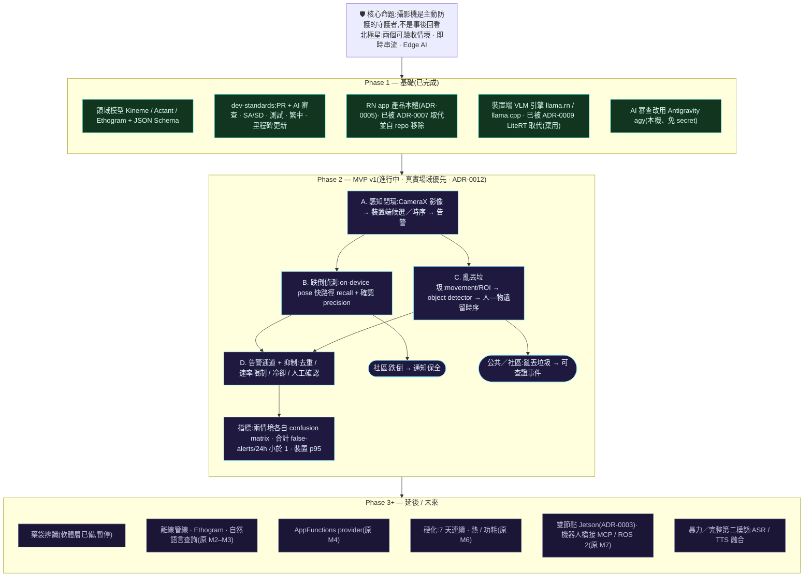

# Roadmap

時程估計以兼職投入為前提。排序的重要性高於數字本身。

> **技術重建中(2026-08-06,ADR-0007,效能優先)。** 產品由 React Native 打掉重練為
> **Rust 感知核心 + 原生 Android(Kotlin/Compose)+ L1 用 Google AI Edge / LiteRT**(ADR-0009,不自建 llama.cpp)。MVP 的功能目標(下方
> 近期功能範圍依 ADR-0012 收斂為「跌倒／倒地」與「亂丟垃圾」兩條垂直管線；實作技術棧改變。重建階段:
> **P0** 骨架(Rust `.so` + Android + JNI)〔✅ 完成:L0 變化閘控(host `cargo test` 綠)、JNI/`.so`、Android 外殼在 Pixel 10 實測 `nativeHello()` 回話 + L0 閘控 PASS〕· **P1** L0 變化閘控接 CameraX luma 流〔✅ 完成:Pixel 10 實測 640×480 即時串流,靜態場景 1/2250 放行 → 省下 ~100% 運算;`ChangeGate` 7 個 JVM 單元測試綠〕·
> **P2** L1 場景描述(**Google AI Edge / LiteRT-LM SDK**,不自建 llama.cpp — ADR-0009)〔✅ 大致完成:L0→L1、App 內模型下載、Compose 全貌、`.litertlm` 原生 Gemma 3n 真描述〕·
> **P2.5** Compose UI ✅ · **P3** L2 事件引擎 🟡〔Rust Fall/ZoneExit/Violence 狀態機 +
> Event serde/schema + Android/JNI bridge + ML Kit 單人 pose/CameraX fast path 已落地；實機校準、
> 匿名單人 preview 框、zoom/旋轉、MediaPipe object candidate、session-local P/O tracker 與
> fail-closed evidence stage 已落地；跌倒場域校準、ROI/多人 association、litter Event 與通知待續〕·
> **P4** 音訊融合(#6)。續作見 [`HANDOFF.md`](HANDOFF.md)。
> 詳見 [ADR-0007](adr/0007-rust-first-redesign.md)。

## 全景圖

> Phase 1 已完成、Phase 2 為目前 MVP、Phase 3+ 延後。以下為各里程碑細節。

## 進度附註(2026-08-08)

- **架構已由 React Native 打掉重練為 Rust 核心 + 原生 Android**(ADR-0007);舊 `app/`(RN)
  與其 `docs/design/app/` 設計文件已自 repo 移除,保留於 git 歷史。
- **L1 執行期改用 Google AI Edge / LiteRT-LM**(ADR-0009,取代 llama.rn / llama.cpp)。
  裝置端(Pixel 10)以 `.litertlm`-native Gemma 3n 產生真實場景描述 ~6.5s;
  MediaPipe `.task` 格式在 litertlm 0.11.0 只吐 `<pad>`,已改用原生 `.litertlm`；ADR-0008 的
  Rust L1 module/JNI placeholder 已移除，Rust 保留正式使用的 L0/L2。
- PR #24/#30 已 merge 至 `main`：裝置 App 已具進入流程、底部導覽、機器之眼手動啟動、
  App 內 gated 模型下載、L0 變化閘控、**L1 真實場景描述**與開發者驗證工具；Rust L2
  Fall/ZoneExit/Violence engine + Event schema 已有 foundation；後續已接上 Android/JNI bridge 與
  ML Kit base `STREAM_MODE` 單人 pose fast path。後續 MediaPipe EfficientDet-Lite2 candidate adapter、
  aHash movement gate、有界佇列、本機 bbox、session-local P/O tracker 與 fail-closed evidence stage
  亦已接線；尚未完成實機素材校準、ROI／多人 association、L2 litter Event 與告警。
- Camera preview 已用 CameraX analysis→PreviewView transform 顯示匿名人物框（關節只作內部特徵，不在產品 UI 顯示）；資料型別預留多人，
  但 detector 仍只回最顯著一人。多人交錯/遮擋解法與驗收追蹤於 issue #36，未完成前不得宣稱多人。
- Preview 採 FIT_CENTER 保留完整人物證據；`fullSensor`、響應式 landscape、Preview/Analysis
  `targetRotation` 與持久化 zoom 已實作，四向實機驗收追蹤於 issue #37。2F→1F 的 1×/2×/3×、
  FOV、主體像素與俯角遮擋驗收見 issue #38。
- MVP 只聚焦跌倒與亂丟垃圾。後者 aHash movement gate → MediaPipe Object Detector candidate →
  session-local P/O tracker → visible separation/stationary/person-left pending-review 已接；ROI、可靠
  多人 association、場域門檻與 L2 Event 仍待續。
  COCO 類別不直接等於垃圾，完整實作與 72h hard-negative 驗收見 issue #39。MediaPipe API
  metrics 採獨立同意，無遙測替代見 #41。
- 前景內明確停止守護與跨 tab 相機狀態已接線：停止先讓 session generation 失效，再 unbind
  CameraX、清 queue/overlay/tracker/L2，避免舊非同步結果污染重啟後 session；Pixel 10 已完成
  跨頁停止、100ms 快停與 40 次 CameraService CONNECT/DISCONNECT 對稱循環，見 #42。
- **關鍵發現:L1 場景描述非可靠跌倒偵測器**(遠景/小主體會漏或幻覺)→ 事件偵測須 L2;
  相機佈建須讓主體佔畫面 ≥ ⅓(見 [`docs/design/vlm/SD.md`](design/vlm/SD.md) §8、issue #26)。
- **2F→1F 首輪實機亦證明 pose 有場域 domain gap:** 1× 無人時樹幹／告示牌出現人體姿態候選，
  2× 有一名被遮擋行人時反而無 output。未完成 #38 固定鏡位 confusion matrix 前不得接告警。
- 首個應用**藥單辨識**的軟體層(schema、prompt、安全解析、單元測試、SA/SD)完成
  ——**現已延後**(見下方 MVP 重新聚焦)。

## MVP v1 重新聚焦(2026-08-08,ADR-0012)

**第一版 MVP = 裝置端(edge AI)的跌倒／倒地安全與亂丟垃圾事件偵測。**
Phase 2 以**手機實機驗證為優先**。

- **社區**:偵測**跌倒** → 通知**保全**。
- **公共／社區場域**:偵測**亂丟垃圾** → 提供可查證的遺留事件供保全處理。
- **暴力／音訊延後**:既有 Rust foundation 保留，但不列入近期完成定義。
- **藥袋辨識延後**(PR #5 成果保留,不刪)。

MVP 里程碑(取代下方 M0–M7 的近期優先序;M2–M7 的概念仍適用):

- **A. 感知閉環(手機)**:CameraX 影像 → 裝置端候選與時序判定 → 螢幕/通知告警。
- **B. 跌倒偵測**:on-device pose(快路徑,recall)+ 確認(precision);指標:recall、false-alerts/24h。
- **C. 亂丟垃圾**:movement/ROI gate + object detector + 匿名人—物時序；指標:object recall、
  litter precision、false-alerts/24h。
- **D. 告警通道 + 抑制**:通知保全 / 聲光告警;去重、速率限制、冷卻、人工確認。

目前 B 的第一條單人 fast path 已接線：ML Kit pose 只提供最顯著一人的 landmark，Kotlin 只推導
pose/descent/motion，不臆造 impact 或多人 strike。Event 暫只寫 log；需先以固定鏡位跌倒/正常
坐下/躺下素材建立 confusion matrix、p95 與 72h negative corpus，達標後才接 D。
Preview 的匿名人物框與主體像素提示是取景工具，不是事件結論或多人能力證明。

---

## (延後)M0 — 後端探路 · 1–2 weeks

先把後續一切所仰賴的數字確立下來。以手機為優先(ADR-0004):目標是在 Pixel 10 上跑 Gemma E2B/E4B。

**工作項目**
- 在 Pixel 10 上服務 Gemma E2B 與 E4B,並透過 `adb forward` 對主機開放(裝置端服務並非一道指令能搞定 — 見 [M0-phone-setup.md](M0-phone-setup.md):以 llama.cpp/Termux 取得快速數據,以 LiteRT-LM 承載應用取得貼近正式環境的延遲)
- 建立 20–40 影格的樣本集(見 `bench/README.md`)— 包含以 `unclear` 為正解的模稜兩可影格
- 跨各種模型大小與網格配置執行 `bench/run_bench.py`
- 以人工為保留下來的樣本評分,判斷影像描述的實用性與幻覺情形
- 評估手機在持續負載下的熱表現與電量漂移(`bench/phone_monitor.py`):會不會熱節流、電量掉得多快

**驗收標準**
- 比較表(E2B vs E4B,以及各網格)存放於 `eval/reports/`
- 選定一個模型大小 + 服務路徑,並記錄為一則 ADR
- **關鍵影格預算拍板** — 手機在不觸發熱節流下每秒能撐住的呼叫數
- 網格問題有解答:2×2 合成影像的成本是否低於 2× 單張影格?

**為何先做:** 如果 p95 延遲是 3 s,整體架構會跟延遲 12 s 時長得完全不一樣。在 12 s 的情況下,即時警示需要雙模型分層 — 一個極小模型負責即時影像描述,一個較大模型負責週期性的深度分析。這是結構性差異,不是調參就能解決的。在手機上這種情況更可能發生而非更少發生,所以由 M0 來拍板。

---

## M1 — 結構化影像描述 · 2–3 weeks

**工作項目**
- 凍結 `schemas/kineme.schema.json`;在 CI 中雙向接上 `core/domain.py` 的驗證
- 以 100 張人工標註影格反覆打磨 `prompts/caption_v1.md`
- JSON 容錯層(程式碼圍籬、前言、尾端註解)
- 搭起 `eval/harness` 骨架

**驗收標準**
- 影像描述可接受度 > 70 %
- JSON 解析成功率 > 98 %
- **幻覺率 < 10 %**(到 M6 收緊至 < 5 %)
- 測試框架能以一道指令執行並產出報告

**schema 在此凍結。** 下游每個模組都相依於它;更動它的成本會逐週累積放大。

---

## M2 — 離線管線 · 3–4 weeks

**工作項目**
- L0 閘控:影格差分、物件偵測、姿態關鍵點、影格嵌入相似度
- L1 對影片檔進行批次執行
- `KinemeStore` — NVMe 上的 SQLite、保留政策、影格加密

**驗收標準**
- 餵入一小時影片,吐出一串 kineme
- 壓縮率 > 100×
- 讀這串 kineme 的人能看懂那段影片發生了什麼

最後那條標準是主觀且不容妥協的。如果這串資料對人來說不可讀,再多的下游摘要都救不回來。

---

## M3 — Ethogram 與查詢 · 3 weeks

**工作項目**
- L3 階層式摘要:kinemes → 15 min → hour → daily `Ethogram`
- 異常偵測,方式是與對象自身過去兩週的軌跡做比較
- L4 嵌入索引與自然語言檢索
- 最小可用的審閱 UI

**驗收標準**
- 「今天家裡發生了什麼?」能產出一份有用的時間軸
- 「昨天下午有沒有人靠近藥盒?」能正確回答並附上時間戳
- Ethogram 實用性 > 3.0(人工,1–5)

---

## M4 — Pixel 10 上的 AppFunctions · 3–4 weeks

**僅相依於 M3。** 刻意排在即時管線之前。

單節點(ADR-0004)讓這件事*更簡單*:store 與 provider 共同駐留在同一支手機上,所以目前還不需要建置 LAN 配對或 gRPC 傳輸。不過現在就把 `core/tools/` 合約抽出來仍然值得,如此一來當 Jetson 雙節點拓撲回歸時,網路傳輸就能原封不動地接上。

**工作項目**
- 抽出 `core/tools/` 合約層 — 單一定義,傳輸方式按需加上
- AppFunctions provider:`getHomeStatus`、`queryKinemes`、`getEthogram`
- (延後至雙節點:透過 mTLS 並以 QR code 交換完成 LAN 配對;gRPC 傳輸)
- **分層同意 UI、呼叫者允許清單、使用者可見的稽核紀錄** — 三者都隨功能一同交付,而非事後補上
- 先執行官方 AppFunctions agent skill 以產生樣板程式碼並精修 KDoc

**驗收標準**
- 向手機助理詢問這個家的狀況,得到一個來源出自裝置端 store 的正確答案
- `adb shell cmd app_function list-app-functions` 顯示正確的中繼資料
- 影格可證明無法從查詢介面觸及 — 根本不存在這樣的程式路徑
- 稽核畫面顯示誰在何時查詢了什麼

**為何排在這:** 它在昂貴的 M5–M6 工作*之前*,先驗證 kineme 品質是否足以支撐自然語言查詢。如果影像描述撐不起一段對話,這個問題會現在浮現,而不是等到第六個月。它同時也是整個計畫中最能展示成果的里程碑。

---

## M5 — 即時管線與警示 · 4–5 weeks

**工作項目**
- 透過 CameraX 進行手機相機擷取(只有在需要第二個來源時,才用備用手機的 RTSP);DeepStream/CSI 是 Jetson 時期才要煩惱的事
- L0 作為常駐的 Android 前景服務(systemd daemon 是 Jetson 時期的做法)
- L2 快路徑:以 pose/motion/action 時序證據產生 candidate/confirmed；VLM 只補客觀脈絡，
  **不能單獨確認或升級 risk**
- 警示抑制:去重、各類別速率限制、被拒後的冷卻期
- 推播通知送達 Pixel

**驗收標準**
- 演練的跌倒能在 p95 < 5 s 內產生通知
- 跌倒召回率 > 90 %
- 誤報 < 3 per 24 h
- 三影格確認能可證明地排除刻意躺下的情況

---

## M6 — 強化 · 4 weeks

**工作項目**
- 連續執行七天
- 熱感知的閘控節流;電源模式調校
- 針對 72 小時無事件語料,把誤報壓到 1 per 24 h 以下
- OpenTelemetry 匯出:延遲、每小時呼叫數、溫度、誤報數
- 端到端驗證保留政策與金鑰輪替

**驗收標準**
- 連續七天,不當機、不熱節流
- **誤報 < 1 per 24 h**
- 幻覺率 < 5 %
- 儀表板呈現所有主要指標

---

## M7 — 機器人橋接 · 3 weeks

**工作項目**
- 建立在同一套 `core/tools/` 合約之上的網路 MCP server
- 發布 `/kinemes` 的 ROS 2 節點
- 空間錨定概念驗證 — 將里程計與地圖座標附加到 kinemes 上

**驗收標準**
- 外部 agent 能透過 MCP 查詢場域記憶
- 一個 ROS 2 訂閱者能收到 kinemes
- 已錨定的 kinemes 能在地圖上呈現

到了這一步,事件記錄就成為一張語意地圖,而這套系統也不再只是相機字幕。

---

## 第二模態閘門

`claustrum` 這個大傘的存在是為了 ASR、TTS 與 LLM 協調。在 `ethogram` 通過 M6 之前,別去動這些模組。有兩個理由:

1. 第二個模態會讓評測面倍增。在第一個模態值得信任之前就這麼做,等於永遠搞不清楚是哪個模態出了錯。
2. 一旦有一個模態走過六個里程碑、與現實反覆碰撞後,融合層該長什麼樣子就會清楚得多。

當這道閘門開啟時,第一個問題不是「要用哪個 ASR 模型」,而是「一則逐字稿 kineme 長什麼樣,以及它是否與視覺 kineme 共用 `ts_start` 語意」。
