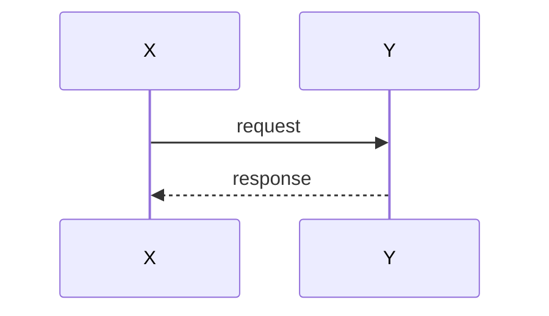

# <module> — System Design (SD)

**Status:** draft | active | stable · **Last updated:** YYYY-MM-DD · **Owner:** <name>
**Implements:** [`SA.md`](SA.md)

## 1. Overview

How the module is built, in brief. The one design idea that matters most.

## 2. Components and responsibilities

Each internal component/class/file and what it is responsible for. A component
diagram if it helps:

## 3. Interfaces and contracts

Public functions, types, schemas, and endpoints the module exposes or depends on.
Keep dependencies behind interfaces so they can be faked in tests (testability is
a project rule).

## 4. Data structures

Key types, schemas, and storage. Reference `core/domain.py` and `schemas/` rather
than duplicating them.

## 5. Key flows

The important sequences, with diagrams:

## 6. Error handling and failure modes

What can fail, how it is detected, and what the module does about it (degrade,
retry, record, alert). For the pipeline: what happens to a kineme on failure.

## 7. Dependencies

Internal and external dependencies, and why each is needed.

## 8. Testing strategy  *(required)*

- What is unit-tested, and with what fakes/fixtures (no hardware in unit tests).
- What needs integration or on-device testing, and how.
- How the acceptance criteria in SA map to tests.
- Which metrics/regressions CI guards.

## Traceability

Requirements from `SA.md` this design satisfies (FR-*, NFR-*), and related ADRs.
