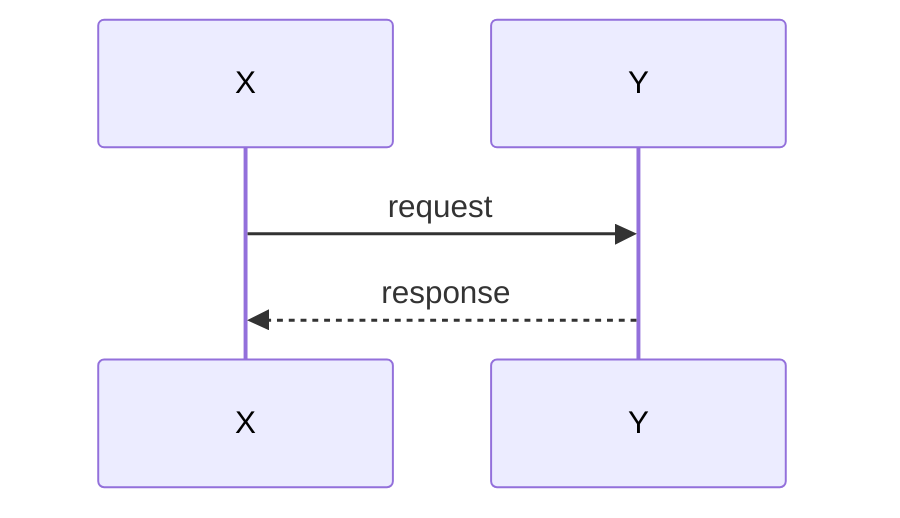

# <module> — System Design (SD)

**狀態:** draft | active | stable · **最後更新:** YYYY-MM-DD · **負責人:** <name>
**實作:** [`SA.md`](SA.md)

## 1. 概觀

模組如何建構,簡述之。那個最重要的單一設計想法。

## 2. 元件與職責

每個內部元件/類別/檔案,以及它負責什麼。有幫助的話附上一張元件圖:

## 3. 介面與合約

模組對外提供或所相依的公開函式、型別、schema 與端點。將相依項置於介面之後,以便在測試中
被替身取代(可測試性是專案規則)。

## 4. 資料結構

關鍵型別、schema 與儲存。引用 `core/domain.py` 與 `schemas/`,而不是複製它們。

## 5. 關鍵流程

重要的序列,附圖:

## 6. 錯誤處理與失效模式

什麼會失敗、如何偵測,以及模組對此做什麼(降級、重試、記錄、警示)。就 pipeline 而言:
kineme 在失敗時會發生什麼。

## 7. 相依性

內部與外部相依項,以及每一項為何需要。

## 8. 測試策略  *(必要)*

- 哪些做單元測試,以及用什麼替身/樣本(單元測試中不含硬體)。
- 哪些需要整合或裝置端測試,以及如何進行。
- SA 中的驗收標準如何對應到測試。
- CI 守衛哪些指標/回歸。

## 追溯

本設計所滿足的 `SA.md` 需求(FR-*、NFR-*),以及相關的 ADR。
