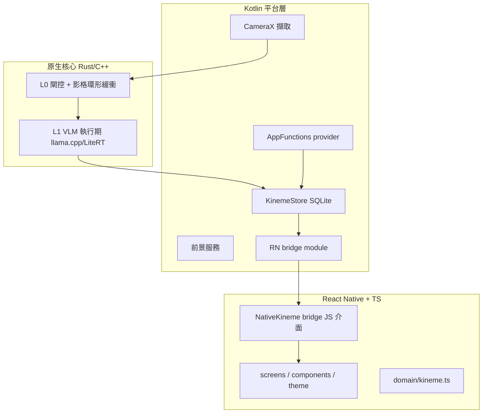
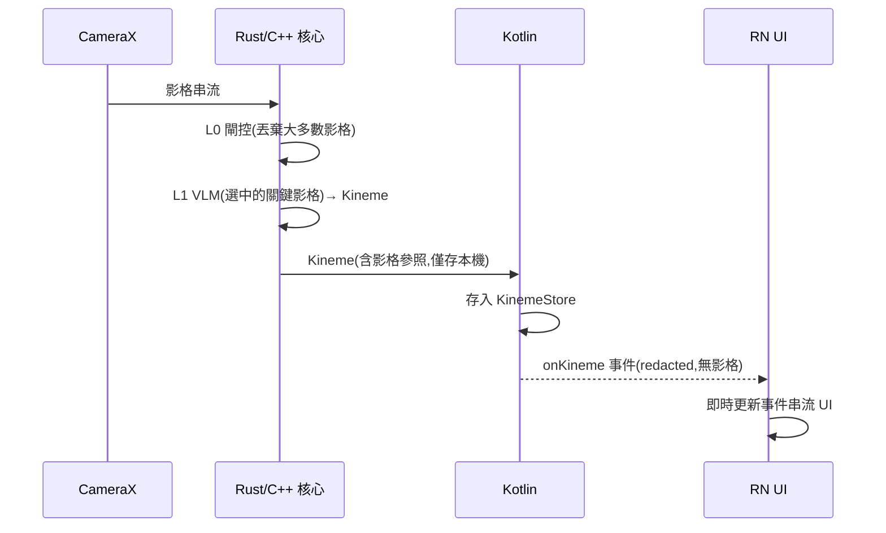

# app — 系統設計(SD)

**狀態:** draft · **最後更新:** 2026-07-31 · **負責人:** claustrum
**實作:** [`SA.md`](SA.md)

## 1. 概觀

三層(ADR-0005):**RN/TS 殼**(UI + 協調)、**原生 Rust/C++ 核心**(L0 閘控、影格環形
緩衝、VLM 執行期等即時/串流熱路徑)、**Kotlin 平台層**(CameraX、AppFunctions、前景
服務、KinemeStore、RN bridge)。最關鍵的設計原則:**影格只存在於原生層,只有去識別化的
`Kineme` 會過 JS bridge。**

## 2. 元件與職責

- **RN/TS** —— 首屏與後續畫面、以 Claude 設計的視覺系統(`app/src/theme.ts`)、domain 型別、bridge 的 JS 介面。
- **原生核心(Rust/C++)** —— 影格擷取後的即時熱路徑;影格不離開此層。
- **Kotlin** —— 平台能力與常駐服務;把 `Kineme`(redacted)透過 bridge 事件推給 RN。

## 3. 介面與合約

- **NativeKineme bridge**(JS ↔ Kotlin):`startSensing()` / `stopSensing()`、
  `onKineme` 事件串流(payload 為去識別化 `Kineme`)、`query(text)`。**影格不在任何介面出現。**
- 領域型別:`app/src/domain/kineme.ts`,由 `schemas/kineme.schema.json` 對應。

## 4. 資料結構

`Kineme`(見 domain/kineme.ts;`keyframe_refs` 在 JS 側刻意缺席)。儲存於 Kotlin 層的
`KinemeStore`(SQLite)。

## 5. 關鍵流程(即時串流 —— 北極星)

## 6. 錯誤處理與失效模式

- 模型載入失敗 / 記憶體不足 → 降級為僅 L0 或停用感測,UI 明示狀態。
- camera 權限缺失 / 被暫停 → 顯示暫停狀態(隱私要求可見)。
- bridge 事件塞車 → 背壓/丟棄舊事件,不阻塞 UI 執行緒。

## 6.5 MVP A 實作附註(感知閉環,ADR-0006)

已落地的第一個切片:相機從「事後回看」轉為「即時守護」。

- `app/src/screens/MonitorScreen.tsx`:以 **react-native-vision-camera**(llama.cpp
  同屬原生層)顯示即時預覽,疊上「監測中 · Edge AI」狀態、告警橫幅與權限流程。
- 權限**由使用者點擊觸發**(非掛載時自動彈窗):相機必要,麥克風為音訊偵測(暴力聲音,
  C)之groundwork,`useMicrophonePermission` 先請求。
- 偵測模型(pose / 音訊)接上前,以「模擬偵測事件」示範 perceive→alert 閉環;偵測落地後
  由裝置端 detector 觸發同一告警通道。
- `App.tsx` 以狀態切換 Home↔Monitor。
- vision-camera 為原生模組,Jest 以 `__mocks__/react-native-vision-camera.js` 替身,
  測試不需裝置。

## 7. 相依性

- `react-native`、TypeScript、**react-native-vision-camera**(+ nitro-modules /
  nitro-image)—— 相機即時預覽/影格。
- (後續)原生核心(Rust/C++;可引入 llama.cpp/LiteRT 等可商用開源)與 Kotlin 模組;
  裝置端推論引擎 **llama.rn / llama.cpp** 已接入。

## 8. 測試策略(必備)

- **TS 純邏輯**(如 `domain/kineme.ts` 的 `isUncertain`、格式化、狀態 reducer)以
  RN 內建的 **Jest** 單元測試,不需裝置。
- **原生核心**(Rust/C++)各自以其語言的單元測試覆蓋 L0/parse 邏輯。
- **bridge 合約**以整合測試驗證(事件 payload 符合 schema、且不含影格欄位)。
- **UI** 以元件測試涵蓋關鍵畫面狀態:目前已有 `__tests__/navigation.test.tsx`
  (Home→Monitor 切換 + 無權限時要求相機/麥克風)與 `medicationParse` 純函式測試。
- CI 現以 `discover -s tests` 跑 Python;app 的 `npm test`(Jest,含 vision-camera 替身)後續納入 CI。

## 追溯

滿足 [`SA.md`](SA.md) 的 FR-1…FR-5、NFR-1…NFR-5。相關:[ADR-0005](../../adr/0005-react-native-app.md)。
