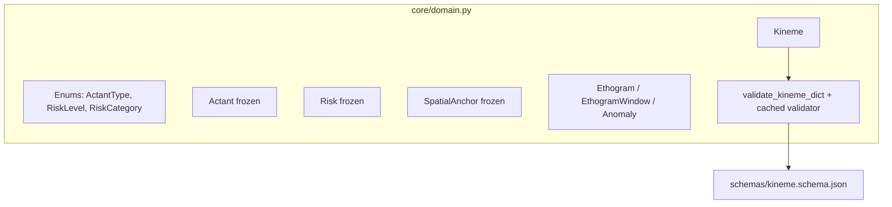
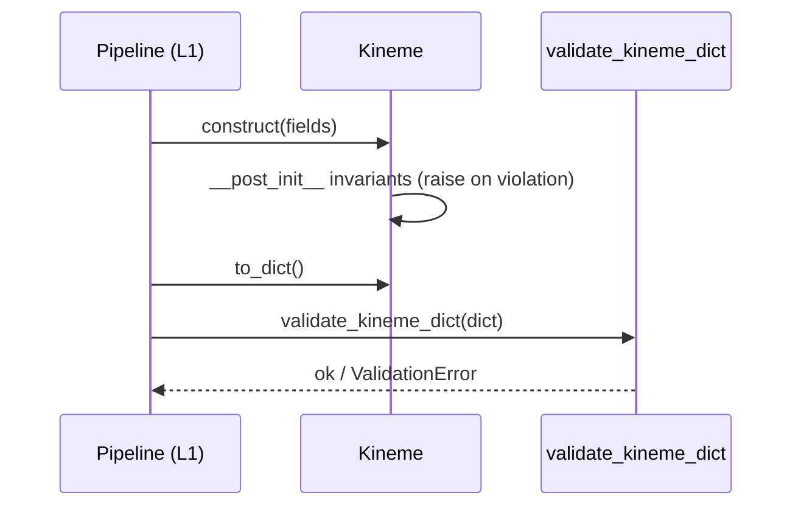

# core — System Design (SD)

**狀態:** active · **最後更新:** 2026-07-30 · **負責人:** claustrum
**實作:** [`SA.md`](SA.md)

## 1. 概觀

`core` 是單一、相依項精簡的模組 [`core/domain.py`](../../../core/domain.py),
外加 [`schemas/`](../../../schemas/) 中的 JSON Schema。最重要的一個想法:專案不可妥協
的限制(不含身分;risk 需要佐證;時間排序;值範圍)在 dataclass 的 `__post_init__`
中落實,因此一個無效的領域物件**根本無法被建構** — 這項保證不倚賴呼叫端記得去檢查。

## 2. 元件與職責

- **Enums** — 封閉列舉;此處若用開放字串會讓 L2 規則引擎變得無法維護(FR-1)。
- **Actant / Risk / SpatialAnchor** — 帶不變式的 frozen 值物件(FR-3、FR-4)。
- **Kineme** — 核心實體;自我驗證並對外提供 `to_dict` 與 `redacted`(FR-2、FR-5)。
- **validator** — 建立一個帶標準函式庫 `date-time` format checker 的快取
  `Draft202012Validator`(FR-6、NFR-1)。

## 3. 介面與合約

- 型別:`Actant`、`Risk`、`SpatialAnchor`、`Kineme`、`Ethogram`、
  `EthogramWindow`、`Anomaly` 及三個列舉。
- `Kineme.to_dict() -> dict` — 完整序列化(當 `spatial_anchor` 為 None 時捨去它)。
- `Kineme.redacted() -> dict` — 剝除 `keyframe_refs`;離節點安全的形式。
- `Kineme.is_uncertain -> bool` — `confidence < 0.5` 或 action == "unclear"。
- `load_schema(name) -> dict`、`validate_kineme_dict(payload) -> None`。

下游傳輸層**必須**送出 `redacted()`,而非 `to_dict()`。目前這是一項慣例;將它提升為
型別(一個 `RedactedKineme`)已記在 SA 的未解問題中,是 `core/tools/` 落地時預定的
強化措施。

## 4. 資料結構

僅在此定義一次,並由 [`schemas/kineme.schema.json`](../../../schemas/kineme.schema.json)
對應。欄位層級的細節存在於那兩個檔案中;本文件不複製它們。

## 5. 關鍵流程

## 6. 錯誤處理與失效模式

- 不變式違規在建構時拋出 `ValueError` — 快速失敗,趕在壞掉的 kineme 進入儲存之前。
- Schema 違規(含格式錯誤的 `date-time`)拋出 `jsonschema.ValidationError`。
- `validate_kineme_dict` 延遲載入 `jsonschema`;缺少這個選用相依項只會在實際請求驗證
  時才浮現。

## 7. 相依性

- 型別與序列化僅用標準函式庫。
- `jsonschema`(選用、延遲載入)供 `validate_kineme_dict` 使用。

## 8. 測試策略  *(必要)*

全部在 [`tests/test_domain.py`](../../../tests/test_domain.py) 中,每次 push/PR 由 CI 執行:

- **Schema 一致** — 最小與完整的 kineme 都通過驗證;schema 列舉等於 Python 列舉;
  **dataclass 欄位名等於 schema 屬性**,雙向皆然(真正的漂移守衛,FR + NFR-2);
  格式錯誤的時間戳會被拒絕(FR-6)。
- **隱私** — 身分形狀的 label 拋出例外;角色槽位通過;schema 不含任何身分欄位;
  `redacted()` 剝除 keyframe(FR-3、FR-5)。
- **抗幻覺** — 無佐證的 risk 拋出例外;`none`/非-`none` 的成對關係被落實;不確定性偵測;
  action 長度上限(FR-4、FR-2)。
- **不變式** — id 格式、時間排序、confidence 範圍(FR-2)。

CI 另外守衛(見 `.github/workflows/ci.yml`):不得提交任何影像,且 schema 中不得有身分
欄位。任何單元測試都不涉及硬體(NFR-3)。

## 追溯

滿足 [`SA.md`](SA.md) 的 FR-1…FR-6 與 NFR-1…NFR-3。
相關:[ADR-0002](../../adr/0002-naming-and-domain-language.md)。
