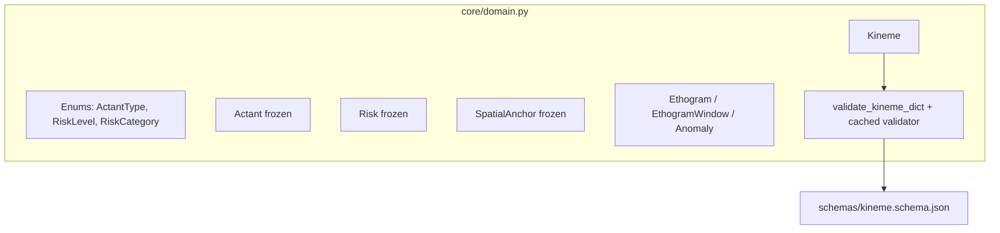
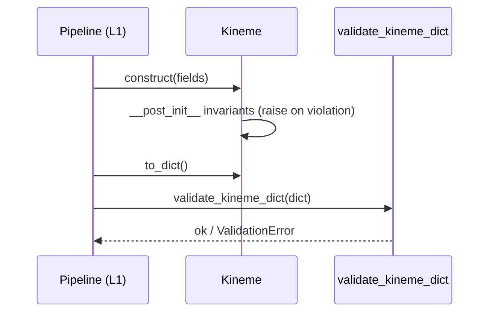

# core — System Design (SD)

**Status:** active · **Last updated:** 2026-07-30 · **Owner:** claustrum
**Implements:** [`SA.md`](SA.md)

## 1. Overview

`core` is a single dependency-light module, [`core/domain.py`](../../../core/domain.py),
plus the JSON Schema in [`schemas/`](../../../schemas/). The one idea that matters:
the project's non-negotiable constraints (no identity; risk needs evidence; time
ordering; value ranges) are enforced in dataclass `__post_init__`, so an invalid
domain object **cannot be constructed** — the guarantee does not depend on callers
remembering to check.

## 2. Components and responsibilities

- **Enums** — closed enumerations; an open string here would make the L2 rules
  engine unmaintainable (FR-1).
- **Actant / Risk / SpatialAnchor** — frozen value objects with invariants
  (FR-3, FR-4).
- **Kineme** — the central entity; validates itself and exposes `to_dict` and
  `redacted` (FR-2, FR-5).
- **validator** — builds a cached `Draft202012Validator` with a stdlib
  `date-time` format checker (FR-6, NFR-1).

## 3. Interfaces and contracts

- Types: `Actant`, `Risk`, `SpatialAnchor`, `Kineme`, `Ethogram`,
  `EthogramWindow`, `Anomaly` and the three enums.
- `Kineme.to_dict() -> dict` — full serialisation (drops `spatial_anchor` when None).
- `Kineme.redacted() -> dict` — strips `keyframe_refs`; the off-node-safe form.
- `Kineme.is_uncertain -> bool` — `confidence < 0.5` or action == "unclear".
- `load_schema(name) -> dict`, `validate_kineme_dict(payload) -> None`.

Downstream transports MUST send `redacted()`, not `to_dict()`. This is currently
a convention; promoting it to a type (a `RedactedKineme`) is noted in SA open
questions and is the intended hardening when `core/tools/` lands.

## 4. Data structures

Defined once here and mirrored by [`schemas/kineme.schema.json`](../../../schemas/kineme.schema.json).
Field-level detail lives in those two files; this doc does not duplicate them.

## 5. Key flows

## 6. Error handling and failure modes

- Invariant violations raise `ValueError` at construction — fail fast, before a
  bad kineme enters the store.
- Schema violations (including malformed `date-time`) raise
  `jsonschema.ValidationError`.
- `validate_kineme_dict` imports `jsonschema` lazily; a missing optional
  dependency surfaces only when validation is actually requested.

## 7. Dependencies

- Standard library only for the types and serialisation.
- `jsonschema` (optional, lazy) for `validate_kineme_dict`.

## 8. Testing strategy  *(required)*

All in [`tests/test_domain.py`](../../../tests/test_domain.py), run by CI on every push/PR:

- **Schema agreement** — minimal and full kinemes validate; schema enums equal
  the Python enums; **dataclass field names equal schema properties** in both
  directions (the real drift guard, FR + NFR-2); a malformed timestamp is
  rejected (FR-6).
- **Privacy** — identity-shaped labels raise; role slots pass; the schema
  contains no identity fields; `redacted()` strips keyframes (FR-3, FR-5).
- **Anti-hallucination** — risk without evidence raises; `none`/non-`none`
  pairing enforced; uncertainty detection; action length cap (FR-4, FR-2).
- **Invariants** — id format, time ordering, confidence range (FR-2).

CI additionally guards (see `.github/workflows/ci.yml`): no committed imagery,
and no identity fields in the schema. No hardware is involved in any unit test
(NFR-3).

## Traceability

Satisfies FR-1…FR-6 and NFR-1…NFR-3 of [`SA.md`](SA.md).
Related: [ADR-0002](../../adr/0002-naming-and-domain-language.md).
