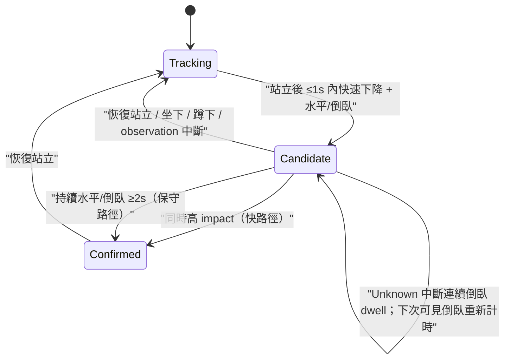
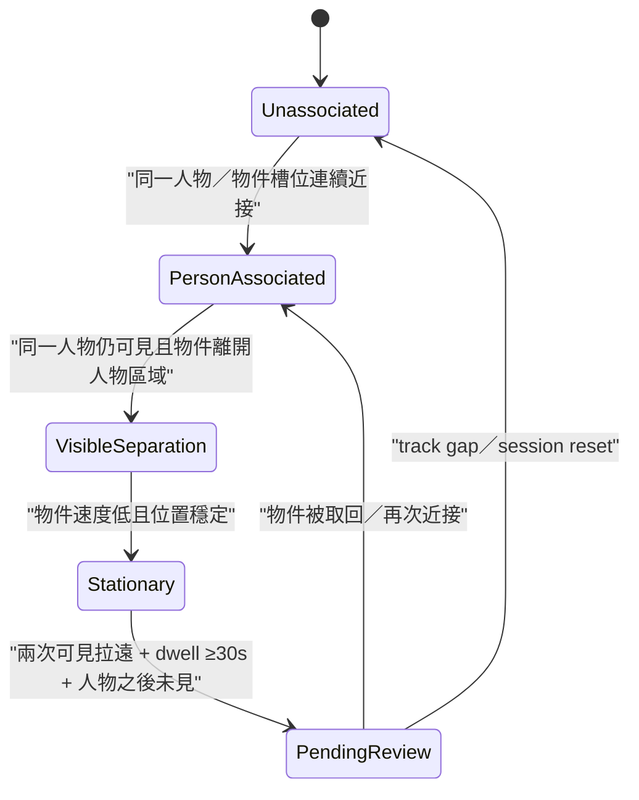

# events(L2 時序事件引擎)— 系統設計(SD)

**狀態:** P3 fast path active · calibration pending · **最後更新:** 2026-08-08 · **負責人:** claustrum
**分析:** [`SA.md`](SA.md)

## 1. 元件

| 元件 | 職責 |
|---|---|
| `core-rs/src/events.rs::EventEngine` | 依 timestamp 消費 observation，輸出新跨越的事件狀態 |
| `core-rs/src/event_bridge.rs::EventEngineRegistry` | 以正數 opaque handle 隔離各 camera session，驗證 lifecycle 並序列化每個 Event |
| `android/.../events/NativeEventEngine` | 將 Kotlin `FastPathObservation` 映射至 JNI；`close()` 可重入，不暴露 Rust 指標 |
| `MlKitPoseFrameAdapter` | 只取肩/髖/膝/踝，正規化為 upright-frame 座標；landmark 不跨 JNI |
| `PoseObservationExtractor` | 純 Kotlin 時序特徵；保守 pose、rapid descent/motion、匿名 slot continuity |
| `MediaPipeObjectDetector`(Android 已接) | EfficientDet-Lite2 `VIDEO` category/score/bbox 邊界；movement gate 後才執行，不產生 Event |
| `AnonymousObjectTracker`(Android 已接) | 同類別 bbox IoU／中心距離的短時 P/O 槽位；3 秒 gap／session 邊界重設，不做外觀或跨 session re-identification |
| `LitterEvidenceTracker`(Android 已接) | 連續近接→可見分離→stationary/dwell→person-left pending-review；不完整證據 fail closed，不產生 Event |
| `TrackState` | 每個匿名 actant 的 fall/zone 狀態；stale 後清除 |
| `ViolenceState` | 每個排序後匿名 actant pair 的 hit window、candidate 與 cooldown |
| `Event::add_vlm_corroboration` | 在事件後附加 bounded L1 描述；不改判斷欄位 |
| `Event::to_json` | serde 序列化為跨 JNI/語言 transport shape |
| `schemas/event.schema.json` | Event 契約與 anti-hallucination/privacy 防線 |

## 2. Fall 狀態機

- 快路徑 evidence:`upright_pose`、`rapid_descent`、`horizontal_or_prone_pose`、`impact_motion`。
- 無 impact 時先輸出低風險 candidate；只有持續倒臥才 confirmed，避免刻意坐下/蹲下誤報。
- confirmed 後維持 latch，直到角色恢復站立，不會每幀重複事件。

## 3. Violence 狀態機

一筆 hit 必須同時滿足:

- `visible_people >= 2` 且 observation 明確提供不同的 `secondary_actant`；
- `motion >= 0.85`、`close_contact >= 0.80`、`strike >= 0.90`；
- 同一排序後匿名 pair 才能累積，1 秒窗內 2 hits → candidate、4 hits → confirmed；
- confirmed 後同 pair 冷卻 30 秒。

不同 pair 絕不共用計數器，避免繁忙場景把無關動作拼成暴力。首版 ML Kit pose fast path
`visible_people<=1` 且不提供 secondary actant/contact/strike，因此**不會**啟動 violence。設定驗證要求 candidate 至少
2 hits、confirmed 必須多於 candidate hits，且所有 score threshold 必須大於 0，避免錯誤設定
把單一或預設零分 sample 變成事件。`strike_score` 必須來自後續經素材校準的動作模型；在
extractor 尚未接上前，本 detector 只有 host-testable contract。

## 4. ZoneExit

`zone_exit=true` 必須是 tracker 判定的「穿越已設定畫面邊界」one-shot，不是「畫面中沒看到人」。
輸出 confirmed `zone_exit`，但 risk 固定 `none/none/null`。同角色 5 秒 cooldown 去重。

## 5. VLM 二階佐證

`add_vlm_corroboration(at, caption)` 只新增 `source=vlm`、`kind=vlm_visible_description` 的 evidence，
截斷至 240 字。方法不寫入 status、risk、confidence、latency；schema 亦規定非 none risk 至少包含
一筆 `fast_path` evidence，因此 VLM-only 事件無法通過契約。

## 5.1 Litter 規劃狀態機

Object Detector 的類別只是候選；「動態物」、「瓶子」或「杯子」都不能直接進入 Candidate。
預設模型 coverage、最小物件像素、association 門檻與 dwell 必須由 2F→1F 場域資料決定。完整
Android candidate 階段已用 aHash movement window、13 類 allowlist 與 bounded latest-frame queue
接線；後續 `AnonymousObjectTracker` 從 normalized bbox 計短時速度／靜止，`LitterEvidenceTracker`
只在近接與分離都具可見證據時前進。人漏偵不算 separation；既有靜止物不會離開 `Observed`；
退背景、撤回、3 秒 track gap 都重設。Preview 顯示的 `P/O` 槽位與 stage 只供本機 commissioning。
greedy 幾何 association 對遮擋、多人多物交錯仍不可靠；ROI／場域門檻、schema/L2 Event 與
policy 仍由 issue #39 交付，避免在尚無資料時固定錯誤事件契約。

## 6. 時序、錯誤與資源

- Engine 假設同 source observation 依 timestamp 排序；out-of-order 直接忽略，避免回捲狀態。
- score 非 finite 視為 0，其他值 clamp 0..1。
- `EventEngine::new` 先驗證 source 長度、score thresholds、時間窗/hit/retention 關係；不合法回
  `EventConfigError`，不讓「所有影格皆命中」的壞設定進入監看。
- 單一 actant observation gap >750ms 會中斷 fall transition；candidate 期間的 `Unknown` pose
  也會中斷「持續倒臥」計時，後續可見倒臥須重新累積 dwell。
- ML Kit STREAM_MODE 無公開 tracking ID；Android extractor 在 landmark 遺失、>750ms gap 或身體
  中心大幅跳位時輪替 `person_<slot>`。slot 是 session role，不是跨幀身分識別。
- actant/pair 超過 60 秒未見即移除，避免長期監看狀態無界成長。
- ID 為 `evt_<detected_at_ms>_<sequence>`；source_id 是邏輯位置，不是硬體序號。
- JNI registry 只發放 `1..Long.MAX_VALUE` handle，不把記憶體位址暴露給 Kotlin；無效或
  已 destroy handle 會被拒絕，不會 dereference freed memory。
- JNI 輸入先驗證 timestamp/slot/count/pose wire value；無事件返回 empty array，無效 payload
  返回 null 並由 Kotlin 明確報錯。影格與 pose landmark 不跨越 JNI。

## 7. Schema/serde 對應

Rust enums 使用 `snake_case` serde；`Event.event_type` rename 為 JSON `type`，`Actant.actant_type`
rename 為 `type`，risk 為 nested object。`to_json` 是正式 transport 邊界。Schema 額外限制:

- `additionalProperties:false`，拒絕 raw frame/keyframe 欄位；
- actant label 只接受 `person_<number>`；
- event type 與 risk category 必須一致；zone_exit risk 必須 none；
- violence 至少兩個 actants；非 none risk 必須有 fast_path evidence + non-empty reason。

## 8. 測試策略

- Rust 合成序列:正常坐下、impact fall、dwell fall、Unknown 中斷 dwell、恢復取消、gap、zone
  去重、孤立 motion、repeated violence、pair 隔離、危險設定拒絕、VLM 不升級、NaN/out-of-order、
  serde transport shape。
- Rust registry 覆蓋 destroy 後拒絕、session 狀態隔離、正數 JNI handle wrap；Kotlin 用 fake bridge
  覆蓋欄位映射、init/payload 錯誤與可重入 close，不需相機或 `.so`。
- `PoseObservationExtractorTest` 覆蓋 upright/seated/horizontal、rapid descent、低信心/缺點、
  timestamp 邊界及 detector 換人時的匿名 slot 隔離；只用純 landmark 資料。
- `ObjectCandidateGateTest` 覆蓋首次放行、active window、最小間隔、periodic probe、out-of-order
  與 reset；`AnonymousObjectTrackerTest` 覆蓋槽位 continuity、motion、類別/gap/reset；
  `LitterEvidenceTrackerTest` 覆蓋 person miss、既有靜止物、完整可見序列、取回與 stale fail-closed；
  bbox normalization/clamp 另由 Android host test 覆蓋。這些只證明排程／幾何／狀態契約，不能
  代替 detector accuracy、多人 ID-switch 或 litter event 測試。
- Python schema:合法 fall、reason 必填、VLM-only 拒絕、zone neutral、角色 privacy、禁止額外 payload。
- 接上 extractor 後必補錄影素材 confusion matrix、p95 end-to-end latency、72h negative corpus 與
  `<1/24h` 誤報門檻；目前 host 測試不能替代實機校準。

## 追溯

[SA](SA.md)、[`events.rs`](../../../core-rs/src/events.rs)、
[`event.schema.json`](../../../schemas/event.schema.json)、[ADR-0006](../../adr/0006-safety-alert-mvp.md)、
[ADR-0012](../../adr/0012-two-scenario-mvp-and-object-gating.md)。
