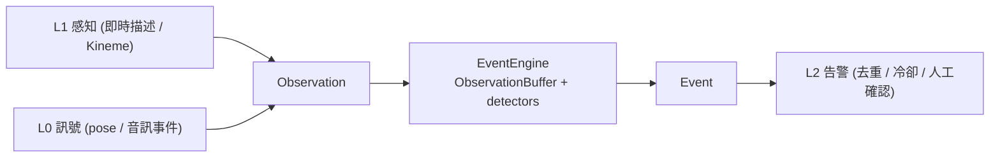
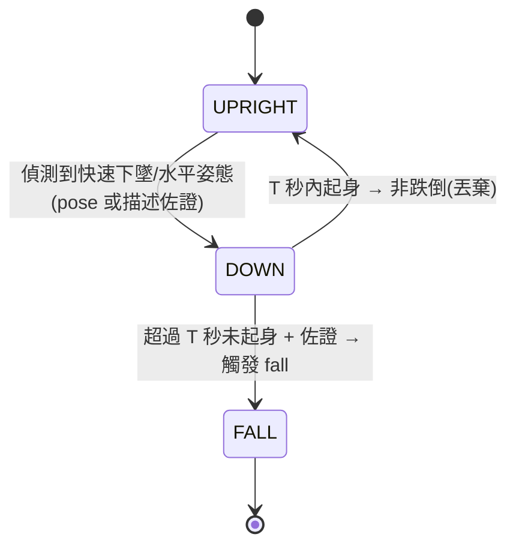

# events(時間性事件引擎)— 系統設計(SD)

**狀態:** draft(規劃)· **最後更新:** 2026-08-06 · **負責人:** claustrum
**實作:** [`SA.md`](SA.md)

## 1. 概觀

一個環形時間窗緩衝(rolling window)+ 一組可插拔偵測器(detector)。每來一筆
`Observation`,引擎更新窗、依序跑各 detector 的狀態機,收集輸出的 `Event`。核心刻意寫成
**純函式 / 純狀態機**(不碰相機、模型、I/O),因此可用合成序列完整單元測試。



## 2. 元件與職責

| 元件 | 職責 |
|---|---|
| `ObservationBuffer` | 依 `ts` 排序的滾動窗;逾時或超量即淘汰。 |
| `Detector`(介面) | `step(buffer, latest) => Event \| null`;各自持有狀態機。 |
| `FallDetector` | 站立→倒地→未起身 的狀態機。 |
| `LeaveDetector` | 門口出現→消失 的狀態機(出門)。 |
| `ViolenceDetector` | 快速衝突動作 + 音訊事件(尖叫/衝突聲)融合。 |
| `EventEngine` | 驅動 buffer + detectors,`ingest(obs) => Event[]`。 |
| `schemas/event.schema.json` | Event 的跨語言契約(單一真實來源)。 |

## 3. 介面與合約

- `EventEngine.ingest(observation: Observation): Event[]` — 純;吃一筆觀察,吐 0..n 事件。
- `Detector.step(buffer: Observation[], latest: Observation): Event | null` — 純狀態機。
- 影像不進入本層(隱私):Observation 只帶文字/座標/音訊標籤,不帶影格。

## 4. 資料結構

```
Observation {
  id; ts;                         // 時間戳(串連的關鍵)
  source_id;
  action?;                        // 來自 L1 的一句描述 / Kineme
  actants?;                       // 場景參與者(角色槽位)
  pose?;                          // 選用:關鍵點 / 姿態摘要(L0)
  audio_events?;                  // 選用:如 ['scream','impact'](L0)
  confidence;
}
Event {
  id; type;                       // 'fall' | 'leave' | 'violence' | ...
  ts_start; ts_end;
  confidence;
  evidence_ids: string[];         // 佐證的 observation ids
  summary;
}
```
`Observation` 的視覺來源即現有 `Kineme`;`Event` 需新增 `schemas/event.schema.json`。

## 5. 關鍵流程 — 偵測器狀態機

**FallDetector**(跌倒):



- **去抖**:需連續 K 幀或 pose+描述雙訊號一致才由 UPRIGHT→DOWN,避免單幀雜訊誤觸發。
- `unclear` / 低信心觀察不推進狀態。

**LeaveDetector**(出門):`PRESENT(近門口)` → 連續 > T 秒 `ABSENT` → 觸發 leave。
**ViolenceDetector**(暴力):時間窗內偵測到「多人靠近 + 快速動作」且**同時**有音訊事件
(尖叫/衝突聲)→ 觸發(音+視融合提高精確率,降低誤報)。

## 6. 錯誤處理與穩健性

- 小模型描述有雜訊 → detector 以**狀態轉移 + 時間門檻 + 多訊號佐證**為主,不吃單筆描述字面。
- 對外告警誤報代價高 → 事件仍須經 L2 抑制(去重/速率限制/冷卻)與人工確認。

## 7. 相依性

- 輸入:L1 即時描述(Kineme)串流 + L0 pose/音訊訊號。
- 核心純邏輯可用 TypeScript 或原生 Rust/C++ 實作;因是純函式,兩者皆可先以 TS 驗證再視效能移原生(ADR-0005)。

## 8. 測試策略(必備)

- 每個 detector 以**合成 Observation 序列**單元測試,不需硬體:
  - Fall:站立→倒地→未起身(正例觸發)/ 倒地後快速起身(負例)/ 單幀雜訊(負例,去抖)。
  - Leave:門口出現→消失(正例)/ 短暫遮擋(負例)。
  - Violence:動作+音訊同時(正例)/ 只有其一(負例,需融合)。
- `EventEngine.ingest` 的視窗淘汰與多 detector 併行以序列測試覆蓋。

## 追溯

滿足 [`SA.md`](SA.md) 的 FR-1…FR-5、NFR-1…NFR-5。相關:[ADR-0006](../../adr/0006-safety-alert-mvp.md)、[ARCHITECTURE.md](../../ARCHITECTURE.md)(L2/L3)。
